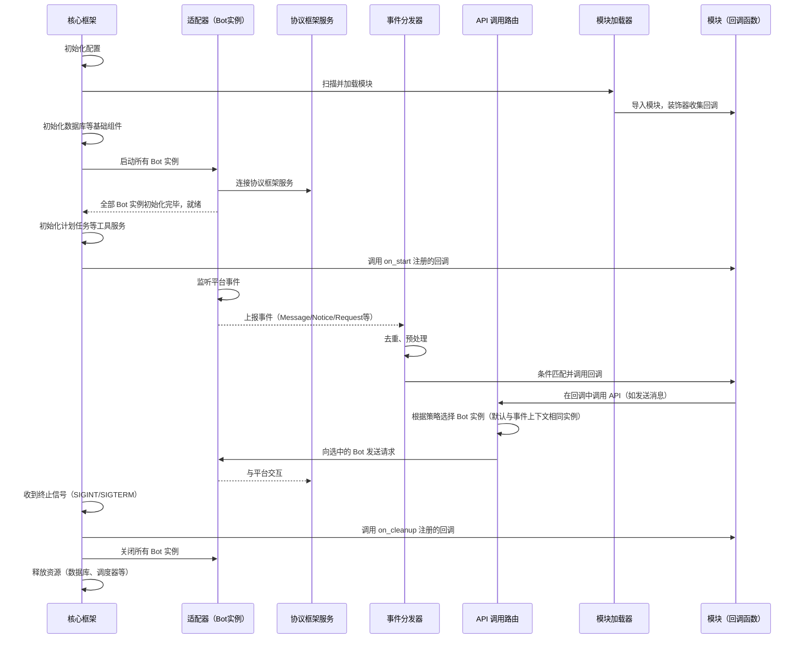

# File: 安装与使用.md

### 环境需求

- CPython >= 3.14

### 安装

首先，下载由源代码打包的压缩包并解压或使用 Git 克隆仓库：
```sh
git clone https://github.com/Eric-Joker/Aha.git
cd Aha
```
然后，安装依赖（择一）：
```sh
pip install -r requirements-full.txt -U # 全部依赖项，包括 性能优化所需库、asyncpg、psycopg[binary]、Playwright、FastAPI 等。
```
```sh
pip install -r requirements.txt -U # 基础依赖项，需额外安装 SQLite 或 postgreSQL 的异步和同步引擎，且不包括性能优化。
```
若存在依赖冲突，请使用 venv 或其他环境隔离方案，或卸载其他依赖着古老依赖的库。

若需要浏览器相关特性，请安装 Playwright：
```sh
# Linux 需要安装依赖。下行仅适用于 Debian / Ubuntu
apt update && apt install -y libgtk-4-1 libgraphene-1.0-0 libxslt1.1 woff2 libevent-2.1-7 libgstreamer-plugins-base1.0-0 libwebpdemux2 libharfbuzz-icu0 libenchant-2-2 libhyphen0 libmanette-0.2-0 gstreamer1.0-plugins-good gstreamer1.0-plugins-bad gstreamer1.0-plugins-ugly
```
```sh
playwright install # 若找不到命令，需要重启当前终端窗口
```

### 配置与运行

```sh
python3.14 aha.py
```

每次启动时，会先检查是否存在新增配置项，若存在会写入配置文件并终止运行，修改配置后可再次启动。

基于环境变量 `BOT_ENV` 区分配置文件，采用的文件为项目目录下的 `config.BOT_ENV.yml`，默认为 `dev`。

配置文件中的`bots`键配置协议适配器，值为列表，每个字典元素都会启动一个适配器服务。适配器的配置详情见[已有适配器](./已有适配器/README.md)。

配置文件的注释也由 Aha 严格管理，非自动生成的注释会被移除。

在 Linux 生产环境时，后续可以通过项目提供的 `./run.sh` 启动项目。

#### CLI 选项

| 选项 | 说明 | 示例 |
| --- | --- | --- |
| `--load-only`/`-l` | 仅加载指定模块。 | `--load-only module1 module2` |
| `--exclude` | 不加载指定模块。 | `--exclude module1 module2` |
| `--no-db-backup` | 存在该选项时，若出现数据库结构更改，跳过备份数据库。 |

### 模块（插件）

在项目根目录下的 `modules` 文件夹中的所有 Python 模块均可视为 Aha 的模块。

#### CLI 模块管理

| 选项 | 说明 | 示例 |
| --- | --- | --- |
| `--enable`/`-e` | 启用指定模块。 | `--enable module1 module2` |
| `--disable`/`-d` | 禁用指定模块。 | `--disable module1 module2` |

其余功能暂不存在。

#### 安装

将`.py`文件或包含`__init__.py`的文件夹放入 `modules` 文件夹下即可。

#### 禁用

将模块文件或文件夹重命名为 `DISABLED` 开头即可。

#### 面向平台用户/群组的黑白名单

[配置文件](./模块开发/统一配置系统.md)的 `aha` 键下有 `default_group_list`、`default_user_list` 键值，表示全局默认的平台用户/群组黑白名单。

Aha 支持在配置文件中为每个模块建立单独的黑白名单：

```yaml
modules.xyz:
  user_list_mode: blacklist  # 模块级黑名单会与默认的黑名单取并集
  user_list:
  - platform: QQ
    user_id: '114514'
  group_list_mode: whitelist  # 模块级白名单会完全忽略默认白名单
  group_list:
  - platform: QQ
    group_id: '1919810'
```

# File: 模块开发/本地化.md

## 本地化

Aha 具有国际化与本地化支持，允许回调根据用户使用的语言动态切换回复内容。本文档将循序渐进地介绍如何为 Aha 模块应用本地化功能。

### 1. 准备翻译文件

在模块目录下创建 `locales/` 文件夹，然后放入以语言代码命名的 YAML 文件。例如：

```
your_module/
├── __init__.py
├── locales/
│   ├── zh_CN.yaml
│   ├── en.yaml
│   └── ja.yaml
└── ...
```

每个 YAML 文件的内容是一个键值对字典，例如 ：

```yaml
# zh_CN.yaml：
hello: "你好"
return: "世界！"
hello_pattern: "你好(?:,|，)?"

# en_US.yaml：
hello: "Hello"
return: "World!"
hello_pattern: "Hello(?:,|，|\s)?"
```

> 语言代码可以为任意字符串。

### 2. 使用本地化

#### 2.1 获取本地化字符串：`_(key)`

```python
from core.i18n import _

print(_('hello'))  # 此时输出的是配置文件中 `aha.lang` 所指定语言的翻译，若没有翻译会尝试回退直至键名本身。
```

`_()` 返回的是一个 `LocalizedString` 对象，它继承自 `str`。

#### 2.2 通过[表达式](事件匹配表达式.md)匹配本地化键名动态获取本地化

对 `PM.message` 采用正则相关或相等/不等比较运算符时，若另一操作数为本地化字符串，则会匹配所有语言，并创建匹配成功的语言的翻译器。会将翻译器传递给回调的 `localizer` 关键字参数。

如：
```python
from core.i18n import _
from core.dispatcher import on_message
from core.expr import Pmsg

@on_message(Pmsg == _('hello'))
@on_message(_('hello_pattern'))  # 正则同样可以本地化。
async def __(event, localizer):
    await event.reply(localizer('return'))  # 回复用户对应语言的文案
```

如果用户使用中文发送“你好”则会回复“世界！”，若用英文发送 “Hello” 则会回复 “World!”。

`on_external` 所注册回调接受的 `localizer` 的语言由上游逻辑指定。

> 所有通过[注册回调装饰器](./订阅与发布事件.md)装饰的函数均可声明 `localizer` 关键字参数。
> 若未触发上述情形，其会优先传递协议适配器在[配置文件](./统一配置系统.md)中 `lang` 键指定的语言的翻译器。

### 进阶说明

#### 语言回退链

当需要获取某语言的翻译时，会按照以下顺序查找：

1. 指定的语言代码（如 `zh_CN`）
2. 该语言代码的基础语言（如 `zh`）
3. 部分基础语言的方言（如 `zh_TW`, `zh_HK` 等，根据 `core.i18n.LANGUAGE_FALLBACKS` 定义）
4. [配置文件](./统一配置系统.md)中 `aha.lang` 指定的默认语言及其基础语言与方言
5. 最后回退到 `en` 和 `zh` 作为保底

因此，若没有为 `zh_CN` 提供翻译，但只要提供了 `zh` 的翻译，也会被使用。

#### 手动获取翻译器：`create_translator`

```python
from core.i18n import create_translator

translator = create_translator(module='modules.your_module', lang_code='zh_CN')
text = translator('some.key')
```

参数 `module` 指定从哪个模块的本地化文件中查找，为 None 时采用框架根目录下的 `locales` 目录中的本地化文件。

# File: 模块开发/订阅与发布事件.md

## 事件

Aha 的设计贯彻着事件驱动原则。模块可以通过为部分事件类别注册回调函数实现事件消费。

### 事件类别

对于模块，共有 5 种公开事件类别和 3 种非公开事件类别。

| 类别 | 对模块公开 | [对象](../数据结构/事件对象.md) | “注册回调装饰器” | 说明 |
| --- | --- | --- | --- | --- |
| CHAT | ✅️ | [models.api.Message](../数据结构/事件对象.md#message) | core.dispatcher.on_message | 用户发送消息。 |
| NOTICE | ✅️ | [models.api.Notice](../数据结构/事件对象.md#notice) | core.dispatcher.on_notice | 用户发送通知。 |
| REQUEST | ✅️ | [models.api.Request](../数据结构/事件对象.md#request) | core.dispatcher.on_request | 用户发送请求。 |
| META | ✅️ | [models.api.MetaEvent](../数据结构/事件对象.md#metaevent) | core.dispatcher.on_meta | 协议服务元事件。 |
| EXTERNAL | ✅️ | Any | core.dispatcher.on_external | 非标准事件结构。用于 Web 请求，也可以作为模块间的触发器。 |
| SENT | ❌ | [models.api.MessageSent](../数据结构/事件对象.md#messagesent) | | 协议服务正在登陆账号所有发送的消息。 |
| RESPONSE | ❌ | Any | | 协议适配器 API 返回值。 |
| SERVICE_REQUEST | ❌ | Any | | 协议适配器向主进程的服务请求。 |

### 注册回调函数

模块通过声明一个函数，并通过上述“注册回调装饰器”装饰该函数以订阅事件。

“注册回调装饰器”实质是一个返回装饰器的函数，其具有一些参数。虽然每个函数的参数不尽相同，但均有个用于筛选事件的参数。对于标准事件，Aha 提供了[基于 DSL（领域特定语言）的筛选方案](./事件匹配表达式.md)；当然，简单地通过正则的筛选并无不可。

> 仅可装饰异步函数。不得装饰非 Python 实现的函数，因为无法获取参数信息。

基本使用方式请参考[示例](./示例.md)与代码中函数的`__doc__`。

#### 一次性回调

通过声明“注册回调装饰器”的 `exp`（过期时间）参数实现，当成功触发一次后，回调将被自动注销。

若传入的值小于10^9，将会被修正为与当前秒级时间戳累加。

```python
from core.dispatcher import on_message
from models.api import Message

@on_message("注册一次性回调")
async def _(event: Message[Text]):
    on_message("114", exp=5*60, callback=callback)
    await event.reply("ok")

async def callback(event: Message):
    await event.reply("514")
```

#### 预处理匹配的消息内容

有些时候我们的业务逻辑需求不那么循规蹈矩。比如我们希望处理任意消息中的图片，但正则等其他方式并不那么优雅且灵活。

 `on_message` 函数提供了 `pre_hook` 参数，用于在匹配前对消息内容进行预处理，且处理后的内容会被替换到回调接受的 `event` 参数的 `message`属性。

```python
from core.dispatcher import on_message
from models.api import Message
from models.msg import Image, MsgSeq

@on_message(pre_hook=lambda msg: MsgSeq(x for x in msg if isinstance(x, Image)))
async def _(event: Message[Image]):
    await event.reply(str(all(isinstance(x, Image) for x in event.message)))
```

### 发布事件

一般用于跨模块功能的触发。暂不存在支持获取返回值的方法，建议直接 import。

建议确保 `on_start` 注册的回调函数被调用后再发布事件。

```python
from functools import partital
from core.dispatcher import on_start, process_external

on_start(partital(process_external, "key", "data"))
```

# File: 模块开发/跨平台统一 ID.md

## Aha ID

> 由于 Aha 是一个跨平台的后端框架，为了一致化数据，我们实现了 Aha ID 机制，用于标识用户、群组。

Aha ID 的数据类型为 int，范围为 ±2^63-1。

在初始状态下，全平台用户的 Aha ID 均是基于哈希唯一的，群组的也是。

Aha ID 允许共用映射，即不同或相同平台的用户可以共用同一个 Aha ID，使业务逻辑认为为一个用户。

我们推荐在业务逻辑中**尽可能使用 Aha ID 作为用户/群组唯一标识**，而不是使用平台的 ID。

> Aha ID 不得直接用于调用 API，必须先进行[额外转换](#从-aha-id-获取平台个体)！

### 从平台个体获取 Aha ID

[事件对象](../数据结构/事件对象.md)提供了便捷获取方法。

```python
from core.dispatcher import on_message
from core.identity import user2aha_id, group2aha_id
from models.api import Message

@on_message()
async def _(event: Message):
    # 当前处于事件上下文中，默认行为与 event.group2aha_id() 一致
    aha_id: int = await group2aha_id()
    aha_id: int = await user2aha_id("123456")  # 获取当前事件上下文相同平台的指定用户的 Aha ID。

# 当前不一定处于事件上下文中
aha_id: int = await user2aha_id("QQ", "123456")  # 获取指定平台指定用户的 Aha ID。
```

### 从 Aha ID 获取平台个体

```python
from core.identity import aha_id2user, aha_id2group
from models.core import User, Group

u: tuple[User, ...] = aha_id2user(123456)
g: tuple[Group, ...] = aha_id2group(123456)
```

### 将平台个体映射到指定的 Aha ID

该行为由内置模块 `id_mapper` 实现，这里懒得写。

# File: 模块开发/事件匹配表达式.md

## 事件匹配表达式

Aha 采用特有的嵌入式 DSL（领域特定语言）实现回调的事件匹配的筛选。通过组合**字段**和**运算符**，可以构建从简单到极其复杂的事件匹配条件，使回调能够通过简洁、直观的语法精准地响应各类事件。

> 由于存在回调间数据隔离的逻辑，建议尽可能使用表达式的非`黑魔法`特性进行前置事件筛选以提升性能，而非回调内部后验。
>
> 黑魔法特性包括 `ApplyTo` 运算符、[属性穿透](#属性穿透)、[pre_hook](./订阅与发布事件.md#预处理匹配的消息内容) 。

### 示例

```python
from core.dispatcher import on_message
from core.expr import Pprefix, Pmsg_chain

@on_message(r"say\s?(.+)", Pprefix == True, Pplatform != "QQ")
```

这个条件匹配：
- 忽略前缀后内容以 `say` 开头（fullmatch），后面跟着任意内容；
- 消息内容必须带有前缀；
- 消息来源平台不为 QQ；

传递给回调函数的多个表达式为并列关系。

[**更多示例**](./示例.md)

### 字段

字段代表从事件中提取到的特定属性，例如消息文本、事件类型等。

Aha 原生的字段都在 `core.expr.PM` 类中定义，可通过[别名](#别名)（如 `Pmsg`）访问。

> 每个字段的实例应全局唯一。

#### 提取值

每个字段都指定了从[事件对象](../数据结构/事件对象.md)提取为特定属性的逻辑，其返回值类型决定了可进行的运算。

对于多元表达式，字段存在优先级的概念，会同时影响与其直接相关的二元表达式的优先级。越大越优先评估，越小越靠后评估，若为 0 会尽可能保持原顺序。

Aha 原生字段：

| 字段 | 类型 | 说明 | 优先级 |
| --- | --- | --- | --- |
| `PM.message` | str | 去除前缀后的字符串格式的消息内容。 | 0 |
| `PM.message_chain` | [MessageChain](../数据结构/消息序列与消息段.md#messagechain) | 去除前缀后的消息链。 | 0 |
| `PM.command` | list[str \| [MsgSeg](../数据结构/消息序列与消息段.md#msgseg)] | 按空格分割的命令参数列表。 | 0 |
| `PM.type_` / `PM.request` / `PM.notice` / `PM.meta` | [EventType](../数据结构/事件对象.md#eventtype) | 事件类型枚举。 | 39 |
| `PM.sub_type` | [EventSubType](../数据结构/事件对象.md#eventsubtype) | 事件子类型。 | 40 |
| `PM.isgroup` | bool | 是否为群聊消息。 | 6 |
| `PM.isprivate` | bool | 是否为私聊消息。 | 7 |
| `PM.gid` | int | 群组的 Aha ID。 | 3 |
| `PM.uid` | int | 用户的 Aha ID。 | 2 |
| `PM.group` | [Group](../数据结构/平台个体.md#modelscoregroup) | 平台群组个体。 | 5 |
| `PM.user` | [User](../数据结构/平台个体.md#modelscoreuser) | 平台用户个体。 | 4 |
| `PM.platform` | str | 事件来源平台名。 | 8 |
| `PM.bot` | int | 接收到该事件的适配器实例 ID。 | 10 |
| `PM.prefix` | bool | 消息是否包含[前缀](./内置轮子与最佳实践/消息前缀.md) 。| 0 |
| `PM.admin` | bool | 触发者是否为群管理员。 | -50 |
| `PM.super` | bool | 触发者是否为超级用户。 | 50 |
| `PM.validated` | bool | 触发者是否通过验证（需模块[注册提取器](#注册-pmvalidated-提取器)）。 | -10 |
| `PM.limit` | bool | 触发者的限速状态，为 True 代表状态正常未限制。 | -999 |

#### 个别字段的特殊逻辑

- **`PM.message`**：
  - 为其进行正则表达式相关运算时会将 Match 对象作为 `match_` 关键字参数**传递给回调函数**。
  - 除此之外还有[本地化特性](./本地化.md)的相关逻辑。

- **`PM.limit`**：其提取器是计数、验证一体的。当 `PM.limit == False` 时会直接跳过提取器逻辑并将提取值设为 True。

- **`PM.command`**：
  - 提取时，先从消息中移除前缀，然后遍历消息链：
        
    若为[Text 消息段](../数据结构/消息序列与消息段.md#text)则将内容按空格分割为多个字符串参数。若含换行，换行后的内容与最后一个参数合并（保留换行）。

    非 Text 消息段作为独立参数保留。
  - 基本用法：进行 `==`、`PrefixOf` 和 `SingletonOf` 相关的运算时，第二操作数可指定为期望的参数列表，列表元素可以是：
    - str：要求对应位置的参数严格相等。
    - 类型注解：比如 `Image`。要求对应位置的参数验证通过，且会将这些参数组成列表通过 `args` 关键字参数**传递给回调函数**。

    `PrefixOf` 匹配后剩余位置的参数也会依次存入 `args` 列表。
  - 示例，假设去除前缀后的消息内容为 `"echo hello world"`：
    ```python
    PM.command == ["echo", str, Text]  # args = ["hello", "world"]
    PM.command == ["echo", "hello", "world"]  # args = []
    PM.command.prefixof(["echo"])  # args = ("hello", "world")
    ```

### 运算符

运算符需依托于表达式对象调用，例如字段就是表达式对象：`Pmsg == "value"`。

若评估出错会中止整个表达式的后续评估并缄默。若有需要可见[调试](#调试)。
| 运算符 | 类 | 说明 | 示例 |
| --- | --- | --- | --- |
| `&` / `and_()` | `And` | 逻辑与，所有子条件必须为真。 | `(Pmsg == "ping") & (Padmin == True)` / `And(Pmsg == "ping", Padmin == True)` |
| `\|` / `or_()` | `Or` | 逻辑或，至少一个子条件为真。 | `(Pplatform == "QQ") \| (Pplatform == "WeChat")` / `Or(Pplatform == "QQ", Pplatform == "WeChat")` |
| `~` / `not_()` | `Not` | 逻辑非，对子条件取反。 | `~(Puid == 123456)` / `Not(Puid == 123456)` |
| `==` | `Equal` | 相等比较。 | `Pmsg == "hello"` |
| `!=` | `NotEqual` | 不等比较。 | `Pmsg != "hello"` |
| `.in_()` | `In` | 左侧值是否包含在容器中。 | `Puid.in_({1,2,3})` |
| `.notin()` | `NotIn` | 左侧值是否不包含在容器中。 | `Puid.notin({4,5,6})` |
| `.contains()` | `Contains` | 左侧容器是否包含指定元素。 | `Pmsg_chain.contains("123")` |
| `.notcontains()` | `NotContains` | 左侧容器是否不包含指定元素。 | `Pmsg_chain.notcontains("123")` |
| `.prefixof()` | `PrefixOf` | 左侧序列是否是指定序列的前缀。 | `Pcommand.prefixof(["help", "status"])` |
| `.notprefixof()` | `NotPrefixOf` | 左侧序列是否不是指定序列的前缀。 | `Pcommand.notprefixof(["admin"])` |
| `.suffixof()` | `SuffixOf` | 左侧序列是否是指定序列的后缀。 | `Pmsg.suffixof(".txt")` |
| `.notsuffixof()` | `NotSuffixOf` | 左侧序列是否不是指定序列的后缀。 | `Pmsg.notsuffixof(".jpg")` |
| `.match()` | `Match` | 字符串是否从开头匹配正则表达式。 | `Pmsg.match(r"hello\s+world")` |
| `.fullmatch()` | `FullMatch` | 字符串是否完全匹配正则表达式。 | `Pmsg.fullmatch(r"\d+")` |
| `.search()` | `Search` | 字符串是否包含正则表达式的匹配。 | `Pmsg.search(r"http://")` |
| `.validateby()` | `ValidateBy` | 左侧对象是否符合指定类型注解。 | `Pmsg_chain.validateby(list[At])` |
| `.applyto()` | `ApplyTo` | 对左侧对象应用 Callable，返回结果。 | `Pmsg.applyto(str.upper)` |
| `.filter()` | `ApplyTo`(配合 `partial(filter, 参数)`) | 对 Sequence 应用 `filter`，返回迭代器。 | `Pmsg_chain.filter(lambda seg: isinstance(seg, Text))` |
| `.to_msg_seq()` | `ApplyTo`(配合 `MessageChain`) | 将左侧对象转换为 [`MessageChain`](../数据结构/消息序列与消息段.md#messagechain)。 | `Pmsg.to_msg_seq()` |
| `.singletonof()` | `SingletonOf` | 序列是否只有一个元素且等于指定对象。 | `Pcommand.singletonof(0)` |
| `.notsingletonof()` | `NotSingletonOf` | 序列不满足 `singletonof`。 | `Pcommand.notsingletonof(0)` |

> 运算符的优先级遵循 Python 运算符优先级规则。

> 这里有两个生成正则表达式片段的工具：[`at_or_str`](./内置轮子与最佳实践/零碎%20utils.md#at_or_str) 和[消息段类可作为正则](../数据结构/消息序列与消息段.md#msgseg)。

> 大部分运算符实质上只是用所有参数生成一个表达式类的实例并返回，所以也可以直接构建实例：
> ```python
> from core.expr import And, Equal, In
> @on_message(And(Equal(Pmsg, "ping"), In(Puid, {1,2,3})))

> <small style="color: gray;">由于存在评估优先级的特性存在，我想不到好的方案以实现变量功能。</small>

#### 属性穿透
表达式实例重载了 `__getattr__` 和 `__call__`。因此，评估时表达式会将上述未声明的公共属性/方法、部分魔术方法调用穿透到提取值上。

例如 `Pmsg_chain[0]` 会生成表达式对象并在评估时提取为第一个消息段。

会穿透的魔术方法有：`__lt__`、`__le__`、`__gt__`、`__ge__`、`__getitem__`、`__add__`、`__sub__`、`__mul__`、`__matmul__`、`__truediv__`、`__floordiv__`、`__mod__`、`__pow__`、`__divmod__`、`__radd__`、`__rsub__`、`__iadd__`、`__isub__`。

示例：
```python
@on_message(Pmsg.search(r"test(.+)test")[1].split()[0].lower() == "test")
```

其中对 `search` 和 `split` 的返回值的 `__getitem__` 调用是穿透到提取值上的；`split` 和 `lower` 是先穿透属性名获取到方法后进行调用的。

> 不会额外拦截私有属性与方法，但请注意与表达式对象自有属性冲突的风险。

### 默认表达式

通过装饰器注册回调时，系统会自动为某些字段补充默认表达式，并与通过[回调函数装饰器](./订阅与发布事件.md)的参数直接声明的表达式进行逻辑与合并。当然，若显式声明了这些字段则不会添加对应的默认表达式。

以下是 Aha 原生的默认表达式：

- **群组黑白名单**：若在[配置文件中配置了](../安装与使用.md#面向平台用户群组的黑白名单)群组白名单，则有 `PM.group.in_(cfg.get_group_whitelist())`；若配置了黑名单，则有 `PM.group.notin(cfg.get_group_blacklist())`。
- **用户黑白名单**：类似地，`PM.user` 会根据模块配置添加默认黑白名单。
- **私聊允许**：若配置项 `aha.private`为 `false` 则有 `PM.isprivate == False`。
- **已验证用户**：当存在为 `PM.validated` 字段[注册提取器](#注册-pmvalidated-提取器)的模块时，则有 `PM.validated == True`。
- **面向单用户的全局限速**：若配置项 `aha.limit` 不为 `0` 则有 `PM.limit == True`。注意，该默认表达式对 [`Notice` 和 `Request` 事件](./订阅与发布事件.md)也有效。

> 对于通过 `on_meta` 注册的回调，默认情况下系统**不会**添加上述默认表达式。

### 人性化设计

为了让表达式更简洁易写，系统提供了多种便捷特性。

#### 简写为非表达式对象

可以尝试在[注册回调装饰器](./订阅与发布事件.md)传入非表达式的 Python 对象作为参数，系统会尝试依据类型自动将其转换为表达式：

- **str**  
  - 若传递给 `on_message` 则转化为 `PM.message.fullmatch(re.compile(str, re.I))`
  - 否则，若作为顶层参数依次出现，则
    - 第一个字符串 → `PM.type_ == str1`
    - 第二个（若有）→ `PM.sub_type == str2`。
- **re.Pattern** → `PM.message.fullmatch(re.Pattern)`
- **list** → `PM.command == list`
- **tuple** → `PM.command == tuple`
- **类型注解**（如 `str`、`List[str]`）→ `PM.message_chain.validateby(类型注解)`
- **`None`** 会被忽略

例：
```python
@on_message("ping")  # 等价于 PM.message.fullmatch("ping")
@on_message(["help", str])  # 等价于 PM.command == ["help", str]
@on_notice("group_increase", "approve")  # 等价于 (PM.type_ == "group_increase") & (PM.sub_type == "approve")
```

#### 运算符自动调整

某些字段与特定运算符组合时，系统会调整运算符以符合语义：

- **对 `PM.message_chain` 使用 `==`**：若右侧是类型注解，则自动转换为 `validateby` 运算符，而不是简单的相等比较。
- **对 `PM.command` 使用 `==` / `!=`**：若右侧是字符串，则自动转换为 `SingletonOf` / `NotSingletonOf` 运算符。

#### 操作数自动转换

当运算符的非表达式操作数类型不匹配时，系统会进行转换：

- **正则运算符**（`match`、`fullmatch`、`search`）：如果指定对象是 str，会自动编译为**忽略大小写**的正则表达式。

#### 对[消息链](../数据结构/消息序列与消息段.md#messagechain)的类型注解支持

通过[回调函数装饰器](./订阅与发布事件.md)的参数直接声明的表达式中未使用 `PM.message`、`PM.message_chain`、`PM.command` 字段，且被装饰函数的 `event` 参数存在指定了 [`Message`](../数据结构/事件对象.md#message) 泛型的类型注解，则会基于此泛型注解生成 `Pmsg_chain.validateby(MessageChain[泛型注解])` 表达式并与直接声明的表达式进行逻辑与合并。

如：
```python
@on_message()  # 会自动生成 Pmsg_chain.validateby(MessageChain[Image])
async def _(event: Message[Image]): ...
```

#### 别名

| 字段 | 别名 |
| --- | --- |
| `PM.message` | `Pmsg`、`PM.msg`、`Pmessage` |
| `PM.message_chain` | `Pmsg_chain`、`PM.msg_chain` |
| `PM.command` | `Pcommand` |
| `PM.isgroup` | `Pisgroup` |
| `PM.isprivate` | `Pisprivate` |
| `PM.gid` | `Pgid` |
| `PM.uid` | `Puid` |
| `PM.group` | `Pgroup` |
| `PM.user` | `Puser` |
| `PM.platform` | `Pplatform` |
| `PM.bot` | `Pbot` |
| `PM.prefix` | `Pprefix` |
| `PM.admin` | `Padmin` |
| `PM.super` | `Psuper` |
| `PM.validated` | `Pvalidated` |
| `PM.limit` | `Plimit` |

这些别名可以直接从 `core.expr` 导入使用。

### 调试

若[配置文件](./统一配置系统.md)中 `aha.debug` 为 `true` 则会进入调试模式：
 - 在[注册回调装饰器](./订阅与发布事件.md)将关键字参数 `debug` 传为 `True`，则会在表达式评估时会打印每个二元运算符操作数与匹配结果。
    ```python
    @on_message("ping", debug=True)
    ```

 - 会打印表达式评估时出现的未捕获异常。

### 进阶教程

#### 各个元素的 Python 本质

- **主要流程**：向[注册回调装饰器](./订阅与发布事件.md)传入表达式后，会构造出由表达式对象组成的树，在每次接收到新的事件时通过 `core.expr.evaluate` 函数进行递归评估。
- **表达式对象**：继承自 `Expr` 的类的实例。**字段**与**二元/逻辑表达式实例**都是表达式对象。
- **字段**：`core.expr.FieldClause` 的实例。其 `field` 参数是 [`Field 描述符`](#field-描述符)，定义了提取器、默认表达式、优先级等字段元信息。
- **二元表达式**：继承自 `BinaryExpr` 的类，如 `Equal`、`In` 等，实现了 `_evaluate_logic` 方法进行实际求值。
- **逻辑表达式**：`And`、`Or`、`Not`，具有 `clause` 属性以存储子表达式。

#### 注册 `PM.validated` 的提取器

`PM.validated` 的提取器不是静态定义的，允许模块通过 `register_extractor` 装饰器注册。

```python
from core.expr import PM, register_extractor

@register_extractor(PM.validated)
async def my_validator(event: BaseEvent):
    return True
```

若存在多个模块注册同一字段的提取器，可由[配置文件](./统一配置系统.md)中的 `expr_extractors.validated` 配置项选择其中一个模块的。可通过 `cfg.validated` 获取当前模块的提取器是否被选取。

#### 新增字段

通过新增字段实现将自定义筛选逻辑提升至前验，不仅可以提升性能还可以与其他字段的特性打配合。

声明一个 `core.expr.FieldClause` 实例即可。

**自定义的字段的任意逻辑均不应该对事件对象中的任何内容进行任何写入行为！**

```python
from core.expr import Field, FieldClause

first_seg = FieldClause("first_seg", Field(lambda event: event.message[0]))

@on_message(first_seg.validateby(Text))
async def _(): ...
```

| 参数 | 类型 | 描述 |
| --- | --- | --- |
| `name` | `str` | 名字，应全模块唯一。 |
| `field` | [`Field`](#field-描述符) | 字段元信息。 |

##### Field 描述符

| 参数 | 类型 | 描述 |
| --- | --- | --- |
| extractor | Callable[[[BaseEvent](../数据结构/事件对象.md#baseevent)], Any] | 从[事件对象](../数据结构/事件对象.md)中提取值的方法。 |
| default | Callable[[FieldClause], Expr \| Any] | 默认表达式。若与最高级二元表达式为并列关系的表达式中没有引用过该字段，会自动添加默认表达式。**自该字段诞生起，默认表达式会作用于所有模块之后注册的所有回调。** |
| priority | int | 优先级。 |
| binary_semantics | Callable[[type["BinaryExpr"], Any], type["BinaryExpr"]] | [运算符自动调整](#运算符自动调整)的实现，转化二元表达式的类型。第二个参数是另一操作数。 |
| rhs_converter | Callable[[Any, type["BinaryExpr"], [EventCategory](../数据结构/事件对象.md#modelscoreeventcategory)], Any] | [操作数自动转换](#操作数自动转换)的实现，修正二元表达式另一端的值。若声明了 `binary_semantics`，第二个参数传递的是转换后的二元表达式类型。 |
| operand_types | dict[type \| Iterable[type], BinaryExpr] | [简写为非表达式对象](#简写为非表达式对象)的实现，注册类型对应的字段与二元运算符。 |
| overrides | dict | 二元表达式评估时，若另一操作数为 key ，设评估结果为 value，此时不再调用提取器。 |
| cache | [CacheConfig](#cacheconfig) | 配置并启用二元表达式评估结果缓存。 |
| skip_default_on_meta | bool | 由 `on_meta` 函数注册时，不添加该字段的默认表达式。默认值为 True。 |

##### CacheConfig

| 参数 | 类型 | 描述 |
| --- | --- | --- |
| cache | [Cache](./内置轮子与最佳实践/缓存器.md) | 缓存器。 |
| key_func | Callable[[type[BinaryExpr], Any, [BaseEvent](../数据结构/事件对象.md#baseevent)], Hashable] | 生成缓存键的函数。第二个参数为另一操作数。 |
| ignore_cache | Callable[[Any, FieldClause, Any, [BaseEvent](../数据结构/事件对象.md#baseevent)], bool] | 决定是否缓存结果的函数。参数依次为：位置参数 评估结果、`left` 当前操作数、`right` 另一操作数、`msg` [事件](../数据结构/事件对象.md)。返回为 `True` 时不进行本次缓存。 |
| skip_cache | Callable[[type[BinaryExpr]], bool] | 决定是否执行缓存相关逻辑。返回为 `True` 时不执行。 |
| contextvars | Iterable[str] | 同时缓存评估结束后指定的 ContextVar，缓存命中时应用。 |

#### 新增运算符

继承 `BinaryExpr` 以定义一个新的二元表达式类并实现 `_evaluate_logic` 方法。具体怎么实现自己研究，我相信你。

> 主要是当前的设计并不算 API 友好，不适合暴露。

# File: 模块开发/示例.md

### 最小示例

```python
from core.dispatcher import on_message
from models.api import Message

@on_message("hello")  # 忽略大小写的正则完全匹配
async def _(event: Message):  # 通过 kwargs 向回调传递参数
    await event.reply("world!")  # 带引用回复
```

### 获取正则捕获组

```python
import re

@on_message(re.compile(r"hello (\w+)"))  # 区分大小写的完全匹配
async def _(event: Message, match_: re.Match):
    await event.reply(f"word {match_[1]}!")
```

### 绝对匹配、发送复杂消息

```python
from core.expr import Pmsg
from models.msg import Text, Image, MsgSeq

@on_message(Pmsg == "hello")  # 绝对匹配
async def _(event: Message):
    msg = MsgSeq(
        Text(text="hello"),  # 实例化消息段时只能使用关键字参数。
        " world!",  # 普通字符串会被自动转换成 Text 实例。
        Image(file="https://http.cat/images/200.jpg")  # 可以为本地路径。
    )
    msg += ["https://http.cat/images/200.jpg"]  # MsgSeq 是 list 的子类，支持绝大多数 list 操作。

    await event.send(msg)  # 无引用直接发送
```

### 处理 [Request](../数据结构/事件对象.md#request) 事件

```python
from core.dispatcher import on_request
from models.api import Request

@on_request("group", "invite")  # 第一个是请求事件主类型，第二个是子类型
@on_request("friend")
async def _(event: Request):
    await event.approve()  # 同意请求
    await event.approve(False)  # 拒绝请求
```

### 通过类型注解约束消息事件、获取文件

```python
from anyio import Path
from models.msg import Downloadable  # Image、Sticker、File、Record、Video 均继承自 Downloadable

@on_message()
async def _(event: Message[Downloadable]):  # 通过类型注解约束匹配的消息内容
    path: Path = await event.message[0].download()  # 下载文件，默认保存至文件缓存目录。可通过 dir_ 和 name 参数指定路径和文件名。
    stream: AsyncGenerator = event.message[0].stream()  # 获取文件流
```

### 调用更多 API

```python
from core.api import API

@on_message()
async def _(event: Message):
    print(await API.get_login_info())
```

# File: 模块开发/统一配置系统.md

## 统一配置系统

Aha 提供了一个配置系统，将所有模块的配置项集中在一个文件中，方便用户调整。

```yaml
bots: ...
aha: ...
cache: ...
log: ...

modules.a:
  # key1 的注释
  key1: "选项1" # 选项1, 选项2
  # key2 的注释
  key2:
  - 1
modules.b: ...
```

### 注册配置项

```python
from core.config import Option, cfg

KEY1: str = cfg.register("key1", Option("选项1", "选项2"), "key1 的注释")
KEY2: tuple = cfg.register("key2", (1,), "key2 的注释")
```

如上，通过 `cfg.register` 方法注册配置项，第一个参数是配置项的键名，第二个参数是配置项的默认值，第三个参数是配置项的注释。

`Option` 对象会自动将第一个值作为默认值，且将所有选项通过行尾注释提示用户。

该配置系统具备类型验证能力，会自动将配置文件中的值转换为与第二个参数默认值相同的类型。如果默认值是 Sequence 或 Mapping，会递归验证。

### 一些限制

`Config` 实例是全局唯一的，子进程不可直接引用该配置系统。

值存在类型限制，必须为 `Option`、`int`、`float`、`Sequence`、`Mapping`、dataclass、[attrs](https://github.com/python-attrs/attrs)、[Pydantic](https://github.com/pydantic/pydantic) Model 或 `None`。

键也存在一些限制。因为读取配置项时**会先从 `aha` 读取**，其次是[表达式字段提取器](./事件匹配表达式.md#可注册提取器)的字段，最后才轮到模块自己的配置项。

#### 目前一定冲突的键名有：

`base64_buffer`、`bot_prefs`、`bot_selector_strategy`、`cache_conv`、`database`、`debug`、`default_group_list`、`default_group_list_mode`、`default_user_list`、`default_user_list_mode`、`execution_mode`、`global_msg_prefix`、`lang`、`limit`、`memory_level`、`playwright`、`point_feat`、`private`、`super`

#### 可能冲突的键名有（即可注册提取器的表达式字段名）：

`validated`

#### 具有特殊用途的键名有：

`group_list`、`group_list_mode`、`msg_prefix`、`user_list`、`user_list_mode`

### 其它方法

#### `cfg.set(key, value)`

设置配置项的值，返回设置的值。

#### `cfg.get(key, default=None)`

获取配置项的值，如果不存在则返回 `default`。

#### `cfg.get_msg_prefix()`

获取 `msg_prefix` 配置项的值，如果不存在则返回 `aha` 配置项的 `global_msg_prefix` 配置项的值。

若只有单个特殊字符则返回半角。

#### `cfg.get_group_blacklist()`

获取模块级群组黑名单与全局黑名单的并集。

#### `cfg.get_user_blacklist()`

获取模块级用户黑名单与全局黑名单的并集。

#### `cfg.get_group_whitelist()`

获取模块级群组白名单，不存在则返回全局白名单。

#### `cfg.get_user_whitelist()`

获取模块级用户白名单，不存在则返回全局白名单。

# File: 模块开发/Aha 码.md

## Aha 码

这是一个类似 [CQ 码](https://docs.go-cqhttp.org/cqcode)的概念，用于将任意[消息段](../数据结构/消息序列与消息段.md)嵌入到字符串中。这是它的基本语法:
```
[Aha:小写消息段类型,属性=值,属性=值]
```
将多个 Aha 码与普通字符串拼接在一起就能得到一个字符串形式的消息序列。其中 [Text](../数据结构/消息序列与消息段.md#text) 消息段不使用 Aha 码形式，例如：
```
[Aha:at,user_id=114514]早上好啊
```

属性值为 `None` 时需省略属性值对。

> Aha 码中不应有多余的空格。

### 转义

可以通过 [`utils.aha.escape_aha` 和 `utils.aha.unescape_aha`](./内置轮子与最佳实践/零碎%20utils.md#escape_aha--unescape_aha) 函数进行转义和反转义 Aha 码。

#### 具体规则

Aha 码由字符 `[` 起始, 以 `]` 结束，并且以 `,` 分割各个参数。如果 Aha 码中的属性值包括了这些字符, 那么它们应该被通过 HTML 实体转义。

| 字符  | 对应实体转义序列 |
| --- | -------- |
| `&` | `&amp;`  |
| `[` | `&#91;`  |
| `]` | `&#93;`  |
| `,` | `&#44;`  |

> 只需要转义这四个字符，其他字符对 Aha 码来说不算特殊字符所以不需要转义。

# File: 模块开发/Aha 生命周期.md

### 整体概览

1. **启动阶段**：框架初始化、加载配置、启动服务、加载模块并调用模块的 `on_start` 回调。
2. **运行阶段**：事件循环等待并分发[事件](./订阅与发布事件.md)，模块回调被触发，可调用 API 与平台交互。
3. **关闭阶段**：收到终止信号后，调用所有模块的 `on_cleanup` 回调，然后释放资源。



### 模块生命周期

一个 Aha 模块的生命周期包含以下阶段：

- **加载**：模块被导入：注册配置、装饰器注册回调等。
- **就绪**：框架完成全部启动流程，调用通过 `core.dispatcher.on_start` 注册的回调函数。
- **运行**：事件触发模块的回调，模块通过 API 与平台交互。
- **卸载**：框架收到终止运行请求时，调用通过 `core.dispatcher.on_cleanup` 注册的回调函数。

# File: 模块开发/README.md

### 准则与注意事项

1. Aha 与协议框架（如 NapCat）互为独立的程序，不具备绝对依赖性。Aha 具有自己的标准。
2. 业务逻辑中所有阻塞的都应该采用异步方案。
3. 一个 Aha 进程可以同时对接多个协议服务，请注意相关逻辑的适配。

### 导航

#### 基本开发

- [示例](./示例.md)
- [订阅与发布事件](./订阅与发布事件.md)
- [统一配置系统](./统一配置系统.md)
- [跨平台统一 ID](./跨平台统一%20ID.md)
- 内置轮子与最佳实践：
  - [权限系统](./内置轮子与最佳实践/权限系统.md)
  - [消息前缀](./内置轮子与最佳实践/消息前缀.md)
  - [经济系统](./内置轮子与最佳实践/经济系统.md)
  - [长效数据](./内置轮子与最佳实践/长效数据.md)
  - [文件缓存](./内置轮子与最佳实践/文件缓存.md)
  - [计划任务](./内置轮子与最佳实践/计划任务.md)
  - [缓存器](./内置轮子与最佳实践/缓存器.md)
  - [菜单注册](./内置轮子与最佳实践/菜单注册.md)
  - [零碎 utils](./内置轮子与最佳实践/零碎%20utils.md)
- [部分数据结构说明](../数据结构/README.md)

#### [向协议服务请求](./向协议服务请求/README.md)

- [Message 有关 API](./向协议服务请求/Message%20有关%20API.md)
- [Account 有关 API](./向协议服务请求/Account%20有关%20API.md)
- [Group 有关 API](./向协议服务请求/Group%20有关%20API.md)
- [Private 有关 API](./向协议服务请求/private%20有关%20API.md)
- [Support 有关 API](./向协议服务请求/Support%20有关%20API.md)

#### 进阶教程

- [事件匹配表达式](./事件匹配表达式.md)
- [Aha 码](./Aha%20码.md)
- [本地化](./本地化.md)
- [Aha 生命周期](./Aha%20生命周期.md)
- 日志：Aha 猴补了 python 标准库的 logging 模块，并添加了 `AHA_DEBUG` 日志等级。通过 `logging.getLogger` 获取 logger 实例即可。

#### 实际模块参考

  - [自动回戳](https://github.com/Eric-Joker/Aha_Modules/blob/main/Er1c/auto_poke/__init__.py)

# File: 数据结构/平台个体.md

### models.core.User

[attrs](https://github.com/python-attrs/attrs) 数据类。

| 属性 | 类型 | 概述 |
| --- | --- | --- |
| platform | str | 平台名称 |
| user_id | str | 平台用户 ID |

### models.core.Group

[attrs](https://github.com/python-attrs/attrs) 数据类。

| 属性 | 类型 | 概述 |
| --- | --- | --- |
| platform | str | 平台名称 |
| group_id | str | 平台群组 ID |

# File: 数据结构/事件对象.md

## 事件对象

本文介绍的是`事件对象`而不是[`事件`](../模块开发/订阅与发布事件.md)。

事件对象实例会出现在注册的回调函数的 `event` 参数中。它们主要用于承载数据，也内置了常用的便捷操作方法（如 reply/approve 等）。

大部分事件相关的对象都声明在 `models.api` 中，所有事件对象都是 `BaseEvent` 的子类，是 [Pydantic](https://github.com/pydantic/pydantic) Model。

事件对象可被哈希，跨进程一致。

**Aha 仍在毛坯期，标准尚未确立，如下所有结构均有可能在以后的版本中发生破坏性更改。** 在之后的版本中适配器可能会实现自己的私有事件子类。

---

### BaseEvent

| 属性/方法 | 类型 | 说明 |
| --- | --- | --- |
| event_type | EventType(enum) | 该事件类别的主类型。 |
| sub_type | EventSubType(enum) | 该事件类别的子类型。 |
| self_id | str | 协议服务所登陆的账号 ID。 |
| time | int | 时间戳。 |
| bot_id | int | 协议适配器实例的 ID，依据配置生成，跨进程一致。 |
| platform | str | 事件来源平台，如 `QQ` 等。 |
| adapter | str | 协议适配器类名，如 `NapCat`。 |

### Message

| 属性/方法 | 类型 | 说明 |
| --- | --- | --- |
| event_type | [MessageEventType(enum)](#messageeventtype) | 主类型。 |
| sub_type | [MessageEventSubType(enum)](#messageeventsubtype) | 子类型。 |
| message_id | str \| None | 协议框架提供的消息 ID。 |
| message | [MessageChain](./消息序列与消息段.md#消息序列) | 消息内容。 |
| get_msg_inline() | [InlineStr](../模块开发/内置轮子与最佳实践/零碎%20utils.md#inlinestr) | 获取对象内联字符串。 |
| sender | [MessageSender](#messagesender) | 发送者基础信息。 |
| user_id | str | 发送者平台 ID。 |
| group_id | str \| None | 群组平台 ID。 |
| user_aha_id() | async int | 用户 [AHA ID](../模块开发/跨平台统一%20ID.md)。 |
| group_aha_id() | async int \| None | 群 [AHA ID](../模块开发/跨平台统一%20ID.md)。事件的 `group_id` 属性为 `None` 时返回 `None`。 |
| user | [User](./平台个体.md#user) | 可用于[事件匹配表达式](../模块开发/事件匹配表达式.md)的 `PM.user` 字段。 |
| group | [Group](./平台个体.md#group) | 可用于[事件匹配表达式](../模块开发/事件匹配表达式.md)的 `PM.group` 字段。 |
| is_group_msg | bool | 是否为群消息。 |

支持类型注解泛型，会将泛型转移至 `message` 属性的泛型：
```python
from models.api import Message
from models.msg import At

async def _(event: Message[At]):
    assert isinstance(event.message[0], At)
```

<details>
<summary>便捷方法</summary>

#### send()

发送消息。

| 参数 | 说明 |
| --- | --- |
| msg | 要发送的消息内容。 |
| at | 是否 @ 发送者。 |
| image | 要发送的图片。|

#### reply()

同 `send()`，自动引用消息。

#### delete()

撤回消息。

#### ban()

在群聊中禁言该用户。

| 参数 | 类型 | 说明 |
| --- | --- | --- |
| duration | int | 禁言时长，单位为秒。 |

#### kick()

在群聊中踢出该用户。

#### poke()

在群聊中 Poke 该用户。

</details>

#### MessageEventType

| 枚举 | 简述 |
| :---: | :---: |
| GROUP | 群聊消息事件 |
| PRIVATE | 私聊消息事件 |

#### MessageEventSubType

| 枚举 | 所属主类型 | 简述 |
| :---: | :---: | :---: |
| NORMAL | GROUP |
| ANONYMOUS | GROUP | 匿名消息 |
| NOTICE | GROUP | 系统提示 |
| TEMPORARY | PRIVATE | 非好友的临时会话 |
| FRIEND | PRIVATE | 好友会话 |

#### MessageSender

| 属性 | 类型 | 简述 |
| --- | --- | --- |
| nickname | str | 昵称 |
| card | str | 群名片 |
| level | str | 群等级 |
| role | [Role(enum)](./API%20相关.md#role) | 群权限 |
| title | str | 群头衔 |

### Request

「加好友」或「加群」请求。[示例](../模块开发/示例.md#处理-request-事件)

| 属性 | 类型 | 说明 |
| --- | --- | --- |
| event_type | [RequestEventType(enum)](#requesteventtype) | 主类型。 |
| sub_type | [RequestEventSubType(enum)](#requesteventsubtype) \| None | 子类型。 |
| comment | str \| None | 请求附言。 |
| flag | str | 请求 flag，用于向协议服务指定该请求。 |
| user_id | str | 请求者 QQ 号。 |
| group_id | str \| None | 群号。 |
| user_aha_id() | async int \| None | 用户 [AHA ID](../模块开发/跨平台统一%20ID.md)。事件的 `user_id` 属性为 `None` 时返回 `None`。 |
| group_aha_id() | async int \| None | 群 [AHA ID](../模块开发/跨平台统一%20ID.md)。事件的 `group_id` 属性为 `None` 时返回 `None`。 |
| user | [User](./平台个体.md#user) | 可用于[事件匹配表达式](../模块开发/事件匹配表达式.md)的 `PM.user` 字段。 |
| group | [Group](./平台个体.md#group) | 可用于[事件匹配表达式](../模块开发/事件匹配表达式.md)的 `PM.group` 字段。 |

<details>
<summary>便捷方法</summary>

#### process()

| 参数 | 类型 | 仅关键字参数 | 说明 |
| --- | --- | --- | --- |
| approve | bool | ❌️ | 是否同意请求。 |
| remark | str \| None | ✅️ | 添加好友时设置备注。 |
| reason | str \| None | ✅️ | 拒绝入群时的拒绝理由。 |

</details>

#### RequestEventType

| 枚举 | 简述 |
| :---: | :---: |
| FRIEND | 加好友请求 |
| GROUP | 加群请求/邀请 |

#### RequestEventSubType

| 枚举 | 所属主类型 | 简述 |
| :---: | :---: | :---: |
| ADD | GROUP | 加群请求 |
| INVITE | GROUP | 入群邀请 |

### Notice

承载群或群成员状态变更、消息状态变更、Poke等通知。

| 属性 | 类型 | 适用事件类型 | 说明 |
| --- | --- | --- | --- |
| event_type | [NoticeEventType(enum)](#noticeeventtype) | | 主类型。 |
| sub_type | [NoticeEventSubType(enum)](#noticeeventsubtype) \| None | | 子类型。 |
| operator_id | str | group_decrease、group_increase、group_ban、group_recall | 操作者平台 ID。 |
| duration | int | group_ban | 禁言时长。 |
| message_id | str | group_recall、friend_recall | 被撤回的消息 ID。 |
| target_id | str | notify.poke | 目标 ID。 |
| user_id | str | ALL | 操作相关用户平台 ID。 |
| group_id | str | group_admin、group_card、group_decrease、group_increase、group_upload、group_recall、group_ban、essence、reaction、notify.title、notify.group_name、notify.poke | 操作相关群平台 ID。 |
| user_aha_id() | async int \| None | | 操作相关用户 [AHA ID](../模块开发/跨平台统一%20ID.md)。事件的 `user_id` 属性为 `None` 时返回 `None`。 |
| group_aha_id() | async int \| None | | 操作相关群 [AHA ID](../模块开发/跨平台统一%20ID.md)。事件的 `group_id` 属性为 `None` 时返回 `None`。 |
| user | [User](./平台个体.md#user) | | 可用于[事件匹配表达式](../模块开发/事件匹配表达式.md)的 `PM.user` 字段。 |
| group | [Group](./平台个体.md#group) | | 可用于[事件匹配表达式](../模块开发/事件匹配表达式.md)的 `PM.group` 字段。 |

#### NoticeEventType

| 枚举 | 简述 |
| :---: | :---: |
| GROUP_ADMIN | 群管理员变更 |
| GROUP_DECREASE | 群成员减少 |
| GROUP_INCREASE | 群成员增加 |
| GROUP_BAN | 群成员禁言 |
| GROUP_CARD | 群成员名片变更 |
| ESSENCE | 群置顶/精华消息变更 |
| FRINED_ADD | 好友添加 |
| GROUP_RECALL | 群消息撤回 |
| FRIEND_RECALL | 好友消息撤回 |
| REACTION | 群消息表情回应 |
| NOTIFY | 通知 |

#### NoticeEventSubType

| 枚举 | 所属主类型 | 简述 |
| :---: | :---: | :---: |
| SET | GROUP_ADMIN | 设置管理员 |
| UNSET | GROUP_ADMIN | 取消管理员 |
| LEAVE | GROUP_DECREASE | 成员离开 |
| KICK | GROUP_DECREASE | 成员被踢 |
| KICK_ME | GROUP_DECREASE | 自己被踢 |
| DISBAND | GROUP_DECREASE | 群被解散 |
| APPROVE | GROUP_INCREASE | 成员通过申请 |
| INVITE | GROUP_INCREASE | 成员被邀请 |
| BAN | GROUP_BAN | 禁言 |
| LIFT_BAN | GROUP_BAN | 解除禁言 |
| POKE | NOTIFY |
| GROUP_NAME | NOTIFY | 群名变更 |
| TITLE | NOTIFY | 群头衔变更 |
| ADD | ESSENCE | 添加群置顶/精华消息 |
| DELETE | ESSENCE | 删除群置顶/精华消息 |

### MetaEvent

协议适配器与协议服务的元事件。

| 属性 | 类型 | 适用事件类型 | 说明 |
| --- | --- | --- | --- |
| event_type | [MetaEventType(enum)](#metaeventtype) | | 主类型。 |
| sub_type | [LifecycleSubType(enum)](#lifecyclesubtype) | LIFECYCLE | 协议适配器生命周期子类型。 |
| interval | int | HEARTBEAT | 心跳间隔。 |
| status | [HeartbeatStatus](#heartbeatstatus) | HEARTBEAT | 心跳状态。 |

#### MetaEventType

| 枚举 | 简述 |
| :---: | :---: |
| HEARTBEAT | 心跳 |
| LIFECYCLE | 协议适配器生命周期 |

#### LifecycleSubType

| 枚举 | 简述 |
| :---: | :---: |
| CONNECT | 与协议服务成功建立持久连接 |
| DISCONNECT | 与协议服务断开持久连接 |

#### HeartbeatStatus

| 属性 | 类型 | 说明 |
| --- | --- | --- |
| online | bool | 协议服务是否在线。 |
| stat | HeartbeatStatusStatistics |

### MessageSent

协议服务登录账号发送消息事件，继承自 [Message](./消息.md#message)。

| 属性 | 类型 | 说明 |
| --- | --- | --- |
| target_id | str \| None | 私聊目标用户平台 ID。 |

### models.core.EventCategory

枚举类型。

| 枚举 | 描述 |
| --- | --- |
| SERVICE_REQUEST | 适配器请求 Aha 服务。 |
| RESPONSE | 多进程模式下适配器响应 API 调用。 |
| EXTERNAL | 外部事件。 |
| CHAT | 消息事件。 |
| NOTICE | 通知事件。 |
| REQUEST | 请求事件。 |
| META | 元事件。 |
| SENT | 消息发送事件。 |

# File: 数据结构/消息序列与消息段.md

## 消息内容结构

Aha 使用**消息段（MsgSeg）** 作为消息的基本组成单元，多个消息段按顺序组合成**消息链（MessageChain）**。

### MessageChain

是继承自 `list` 的容器，专门用于存放消息段实例。

#### 创建消息序列

```python
from models.msg import MsgSeq

msg = MsgSeq("Hello", Image(file="path/to/image.jpg")) # 从多个字符串或消息段创建

segments = [Text("Hello"), At(user_id="123456")]
msg = MsgSeq(segments) # 从可迭代对象创建
```

- 所有非 `MsgSeg` 的元素会被自动转换为 `Text` 段。

#### 操作消息链

`MessageChain` 支持所有列表方法，且会自动将添加的字符串转为 `Text` 段。此外提供了一些实用方法：

- `filter(cls)`：返回只包含指定类型消息段的新链。
- `is_user_at(user_id, include_all=False)`：检查是否 @ 了指定用户。
- `__str__`：序列化为包含 Aha 码的字符串。

### MsgSeg

是 [Pydantic](https://github.com/pydantic/pydantic) Model。每个消息段代表一种特定类型的消息内容，如纯文本、图片、@等。所有消息段均继承自 `MsgSeg`，并拥有以下通用特性：

- 实例具有 `__str__`，可被转换成 [Aha 码](../模块开发/Aha%20码.md)。

- 消息段元类实现了 `__str__` 方法，返回匹配对应 Aha 码的正则表达式字符串，可通过 `Match[属性名]` 获取[**转义**](../模块开发/Aha%20码.md#转义)**后**的属性值字符串。类方法 `prefixed_re_group(prefix)` 生成的正则会为命名捕获组添加前缀。
  ```python
  pattern = re.compile(str(At))  # \[Aha:at(?:,user_id=(?P<user_id>[\s\S]*?))?(?:,name=(?P<name>[\s\S]*?))?\]
  match = pattern.match("[Aha:at,user_id=123456,name=小明]")
  match["user_id"]  # "123456"

  re.compile(At.prefixed_re_group("at_"))  # \[Aha:at(?:,user_id=(?P<at_user_id>[\s\S]*?))?(?:,name=(?P<at_name>[\s\S]*?))?\]
  ```

#### Text
纯文本。

| 属性 | 类型 | 说明 |
| --- | --- | --- |
| text | str | 文本内容。 |

**示例**：`Text(text="你好")`

#### At
@某人或全体成员。

| 属性 | 类型 | 说明 |
| --- | --- | --- |
| user_id | str \| None | 被@用户的平台 ID，`"all"` 表示全体。 |
| name | str | 用户名，发送时无需设置。 |

**`At.all()`**：返回 @全体 的段。

**示例**：`At(user_id="123456")`

#### Reply
引用消息。要放在消息链的开头。

| 属性 | 类型 | 说明 |
| --- | --- | --- |
| id | str | 被引用的消息 ID。 |

#### Downloadable
可下载消息段基类。

| 属性 | 类型 | 说明 |
| --- | --- | --- |
| file | str \| Path \| bytes | 文件源，可能为本地路径或 URL。在少数情况下可能为 `bytes`，但此时不可参与 [API 调用](../模块开发/向协议服务请求/说明.md)。 |
| name | str | 文件名。 |
| file_id | Any | 适配器返回的文件唯一 ID。 |
| thumb | str \| None | 缩略图URL或路径。 |
| file_type | str \| None | 文件类型（只读）。 |
| file_size | int \| None | 文件大小（只读）。 |

**下载与流式**：

```python

path = await image.download()  # 下载至文件缓存服务
path = await image.download(dir_="./images", name="custom.jpg")  # 下载到指定路径，覆盖已有文件。

async for chunk in video.stream(): # 获取文件流（逐块读取）
    pass
```

> 下载至文件缓存服务时，最小存活时间由[配置文件](../统一配置系统.md)中的 `cache.file_msg_ttl` 指定。

#### Image
图片。继承自 [Downloadable](#downloadable)。

| 属性 | 类型 | 说明 |
| --- | --- | --- |
| summary | str \| None | 描述。 |
| sub_type | Any | 子类型。 |

从PIL图像创建：
```python
from PIL import Image as PILImage
from models.msg import Image

img = PILImage.open("cat.jpg")
seg = await Image.from_pil(img, format="PNG", name="cat.png")  # 实质上是保存文件至文件缓存服务。后两个参数可省略。
```

#### Sticker
动画表情。继承自 [Downloadable](#downloadable)。属性同 [`Image`](#image)。

#### File
普通文件。继承自 [Downloadable](#downloadable)。

| 属性 | 类型 | 说明 |
| --- | --- | --- |
| group_id | str \| None | 群文件所属群聊平台 ID。 |

#### Record
语音。继承自 [Downloadable](#downloadable)。

下载/流式时可通过 `record_format` 参数指定文件格式，值为 [`AudioFormat`](../数据结构/API%20相关.md#modelsapiaudioformat) 枚举。

#### Video
视频。继承自 [Downloadable](#downloadable)，无额外属性。

#### Share
链接分享。

| 属性 | 类型 | 说明 |
| --- | --- | --- |
| url | str | 分享链接。 |
| title | str \| None | 标题。 |
| content | str \| None | 简介。 |
| image | str \| Path \| None | 封面图。 |

#### Contact
推荐好友或群。

| 属性 | 类型 | 说明 |
| --- | --- | --- |
| type | Literal["friend", "group"] | 联系人类型。 |
| id | str \| None | 用户平台 ID 或群聊平台 ID。 |

#### Location
地理位置。

| 属性 | 类型 | 说明 |
| --- | --- | --- |
| lat | float | 纬度。 |
| lon | float | 经度。 |
| title | str \| None | 地点名称。 |
| content | str \| None | 详细地址。 |

#### Music
音乐分享。

| 属性 | 类型 | 说明 |
| --- | --- | --- |
| url | str | 跳转链接。 |
| audio | str \| None | 音频文件 URL。 |
| title | str \| None | 标题。 |
| image | str \| Path | 封面。 |
| content | str \| None | 更多信息，一般是歌手名。 |

#### Json
Json 卡片消息。

| 属性 | 类型 | 说明 |
| --- | --- | --- |
| data | dict \| list | 解析后的 json。 |

#### Xml
Xml 卡片消息。

| 属性 | 类型 | 说明 |
| --- | --- | --- |
| data | lxml.etree._Element | 解析后的 XML。 |

#### Markdown
Markdown 卡片消息。

| 属性 | 类型 | 说明 |
| --- | --- | --- |
| content | str | Markdown 原文。 |

#### 合并转发

##### Forward
合并转发（消息记录）。

有两种表示方式：
- **仅含 ID**：`Forward(id="12345")`，之后若有需要可以通过 [API](../模块开发/向协议服务请求/Message%20有关%20API.md#get_forward_msg) 拉取内容。
- **含完整消息内容**：`Forward(content=[Node(...), ...])`

| 属性 | 类型 | 说明 |
| --- | --- | --- |
| id | str \| None | 协议服务提供的转发消息ID。 |
| content | MessageChain[Node] \| None | 消息内容。 |
| message_type | "group" \| "private" | 自动推断，也可手动指定。 |

<details>
<summary>便捷方法</summary>

**`async get_content()`**：

根据 `id` 属性拉取消息内容并赋值给 `content`。可通过 [`select_bot`](../模块开发/向协议服务请求/说明.md#指定-bot-实例) 指定 `bot_id` 参数。

**`filter(cls)`**：

返回所有节点中指定类型消息段的扁平链。

**`async append(Node)`**：

添加一个节点。可指定 `user_id` 和 `nickname` 参数时，未指定时自动从 `bot_id` 参数[获取](../模块开发/向协议服务请求/Account%20有关%20API.md#get_login_info)，未指定 `bot_id` 时采用与当前事件上下文相同的。

**`async extend(Iterable[Node])`**：

批量添加节点，其余参数同上。

**`classmethod async from_content(MessageChain)`**：

从内容列表直接构造，其余参数同上。

</details>

> 一个消息链中 `Forward` 不得与其他消息段混用。

##### Node
转发节点，用于为合并转发的每条消息绑定发送者。只可出现在 `Forward.content` 中。

| 属性 | 类型 | 说明 |
| --- | --- | --- |
| user_id | str \| None | 发送者平台 ID。 |
| nickname | str | 发送者昵称。 |
| content | MessageChain | 消息内容（不可包含 `Node` 实例）。 |

##### 示例

```python
from models.msg import Forward, Node, Image

# 通过 from_content 快速创建
forward = await Forward.from_content(
    content=["第一条消息", Image(file="img.jpg"), "第二条消息"],
    user_id="111",          # 如果不指定，则自动获取bot自身信息
    nickname="MyBot"
)

# 或手动构造节点
node1 = Node(user_id="111", nickname="Alice", content="你好")
node2 = Node(user_id="222", nickname="Bob", content=Image(file="bob.png"))
forward = Forward(content=[node1, node2])

# 发送到群聊
await API.send_group_msg(group_id=123456, message=forward)
```
# File: 数据结构/API 相关.md

## API 数据结构

适配器的返回值不一定能具备所有属性，此时属性值会为 `None`。

### models.api.ReactionUser

[Pydantic](https://github.com/pydantic/pydantic) Model。

| 属性 | 类型 | 概述 |
| --- | --- | --- |
| user_id | str | 平台用户 ID |
| nickname | str | 用户昵称 |
| avatar_url | str | 用户头像源 |

### models.api.Sex

枚举类型。

| 成员 | 值 | 概述 |
| :---: | :---: | :---: |
| MALE | "male" | 男性 |
| FEMALE | "female" | 女性 |
| UNKNOWN | "unknown" | 未知 |

### models.api.Role

枚举类型。

| 成员 | 值 | 概述 |
| :---: | :---: | :---: |
| OWNER | "owner" | 群主 |
| ADMIN | "admin" | 管理员 |
| MEMBER | "member" | 普通成员 |

### models.api.EssenceMessage

[Pydantic](https://github.com/pydantic/pydantic) Model。

| 属性 | 类型 | 概述 |
| --- | --- | --- |
| sender_id | str | 消息发送者平台用户 ID |
| sender_nick | str | 消息发送者昵称 |
| operator_id | str | 操作者平台用户 ID |
| operator_nick | str | 操作者昵称 |
| message_id | str | 消息 ID |
| operator_time | datetime | 设为精华消息的时间 |
| message | [MessageChain](../数据结构/消息序列与消息段.md#消息序列) | 消息内容 |
| message_str | str | 字符串格式的消息内容 |

#### EssenceMessage.get_msg_inline()

获取 [InlineStr](../模块开发/内置轮子与最佳实践/零碎%20utils.md#inlinestr) 格式的消息内容。

### models.api.GroupFile

[Pydantic](https://github.com/pydantic/pydantic) Model。

| 属性 | 类型 | 概述 |
| --- | --- | --- |
| group_id | str | 群号 |
| file_id | str | 文件 ID |
| file_name | str | 文件名 |
| busid | int | 文件传输类型 ID |
| file_size | int | 文件大小 （字节） |
| upload_time | datetime | 上传时间 |
| dead_time | datetime | 文件过期时间 |
| modify_time | datetime | 最后修改时间 |
| download_times | int | 下载次数 |
| uploader | str | 上传者平台用户 ID |
| uploader_name | str | 上传者昵称 |

### models.api.GroupFolder

[Pydantic](https://github.com/pydantic/pydantic) Model。

| 属性 | 类型 | 概述 |
| --- | --- | --- |
| group_id | str | 群号 |
| folder_id | str | 文件夹 ID |
| folder | str | 文件夹路径或标识 |
| folder_name | str | 文件夹名称 |
| create_time | datetime | 创建时间 |
| creator | str | 创建者平台用户 ID |
| creator_name | str | 创建者昵称 |
| total_file_count | int | 文件夹内文件总数 |

### models.api.GroupFiles

[Pydantic](https://github.com/pydantic/pydantic) Model。

| 属性 | 类型 | 概述 |
| --- | --- | --- |
| files | list[[GroupFile](#modelsapigroupfile)] | 文件列表 |
| folders | list[[GroupFolder](#modelsapigroupfolder)] | 文件夹列表 |

### models.api.GroupInfo

[Pydantic](https://github.com/pydantic/pydantic) Model。

| 属性 | 类型 | 概述 |
| --- | --- | --- |
| group_all_shut | bool | 全员禁言状态 |
| group_remark | str | 群备注 |
| group_id | str | 群号 |
| group_name | str | 群名称 |
| member_count | int \| None | 当前群成员数量 |

### models.api.GroupMemberInfo

[Pydantic](https://github.com/pydantic/pydantic) Model。

| 属性 | 类型 | 概述 |
| --- | --- | --- |
| group_id | str | 群号 |
| user_id | str | 用户平台 ID |
| nickname | str \| None | 用户昵称 |
| card | str \| None | 群昵称 |
| sex | [Sex](#modelsapisex) | 性别 |
| age | int \| None | 年龄 |
| area | str | 地区 |
| join_time | datetime \| None | 加入群的时间 |
| last_sent_time | datetime \| None | 最后发言时间 |
| unfriendly | bool | 是否被标记为不友好用户 |
| is_robot | bool | 是否为机器人账号 |
| shut_up_time | datetime \| None | 禁言截止时间 |
| role | [Role](#modelsapirole) | 群权限 |
| title | str \| None | 群头衔 |

### models.api.GroupMembers

继承自 frozenset。

#### GroupMembers.is_admin()

判断指定用户平台 ID 是否为管理员或群主。

| 参数 | 类型 | 概述 |
| --- | --- | --- |
| user_id | str | 用户平台 ID |

**返回**：bool

#### GroupMembers.is_manager_of()

判断第一个用户是否对第二个用户具有管理权限。

| 参数 | 类型 | 概述 |
| --- | --- | --- |
| manager | str | 管理者用户平台 ID |
| subordinate | str | 下属用户平台 ID |

**返回**：bool

#### GroupMembers.filter_by_last_sent_time_upto_now()

返回最后发言时间在指定秒数以内的成员列表。仅对 `last_sent_time` 字段不为 `None` 的成员进行判断。

| 参数 | 类型 | 概述 |
| --- | --- | --- |
| seconds | int | 距离当前时间的秒数 |

**返回**：[GroupMembers](#modelsapigroupmembers)

#### GroupMembers.filter_by_role()

返回具有指定群权限等级的成员列表。

| 参数 | 类型 | 概述 |
| --- | --- | --- |
| role | [Role](#modelsapirole) |  |

**返回**：[GroupMembers](#modelsapigroupmembers)

#### GroupMembers.filter_by_role_not_in()

返回群角色不在指定列表中的成员列表。

| 参数 | 类型 | 概述 |
| --- | --- | --- |
| roles | Container[[Role](#modelsapirole)] |  |

**返回**：[GroupMembers](#modelsapigroupmembers)

#### GroupMembers.filter_by_have_title()

返回拥有群头衔（`title` 字段不为空字符串或 `None`）的成员列表。

**参数**：无

**返回**：[GroupMembers](#modelsapigroupmembers)

### models.api.LoginInfo

[Pydantic](https://github.com/pydantic/pydantic) Model。

| 属性 | 类型 | 概述 |
| --- | --- | --- |
| nickname | str | 昵称 |
| user_id | str | 账户平台 ID |

### models.api.Friend

[Pydantic](https://github.com/pydantic/pydantic) Model。

| 属性 | 类型 | 概述 |
| --- | --- | --- |
| user_id | str | 好友用户平台 ID |
| nickname | str | 好友昵称 |
| remark | str \| None | 好友备注 |
| sex | str \| None | 性别 |
| level | int \| None | 好友等级 |
| age | int \| None | 年龄 |
| birthday | date \| None | 生日 |
| phone_num | str \| None | 手机号码 |
| email | str \| None | 电子邮箱 |
| category_id | int \| None | 所属好友分组 ID |

### models.api.FriendCategory

[Pydantic](https://github.com/pydantic/pydantic) Model。

| 属性 | 类型 | 概述 |
| --- | --- | --- |
| category_id | int | 好友分组 ID |
| category_name | str | 好友分组名称 |
| online_count | int \| None | 分组在线好友数量 |
| friends | list[[Friend](#modelsapifriend)] | 分组好友列表 |

### models.api.LastestMsgs

[Pydantic](https://github.com/pydantic/pydantic) Model。

| 属性 | 类型 | 概述 |
| --- | --- | --- |
| peer_id | str | 对端平台 ID |
| remark | str | 备注 |
| msg_time | datetime | 最新一条消息的发送时间 |
| chat_type | [MessageSubType](./事件对象.md#messagesubtype) | 聊天类型 |
| message_id | str | 最新一条消息的消息 ID |
| sender | [MessageSender](./事件对象.md#messagesender) | 发送者的昵称 |
| peer_name | str | 对端的名称（如好友昵称或群名称） |
| latest_msg | [Message](./事件对象.md#message) | 最新一条消息 |

### models.api.Stranger

[Pydantic](https://github.com/pydantic/pydantic) Model。

| 属性 | 类型 | 概述 |
| --- | --- | --- |
| user_id | str | 用户平台 ID |
| nickname | str | 昵称 |
| sex | str | 性别 |
| age | int \| None | 年龄 |
| level | int \| None | 等级 |
| bio | str \| None | 个性签名 |
| reg_time | datetime \| None | 注册时间 |
| is_vip | bool \| None | 是否为 VIP 用户 |
| remark | str \| None | 备注 |

### models.api.AudioFormat

枚举类型。

| 成员 | 值 |
| :---: | :---: |
| MP3 | "mp3" |
| AMR | "amr" |
| WMA | "wma" |
| M4A | "m4a" |
| OGG | "ogg" |
| WAV | "wav" |
| FLAC | "flac" |
| SPX | "spx" |

# File: 数据结构/README.md

### 更多的请见源代码，懒得写了以后再说。

### 导航

- [事件对象](./事件对象.md)
- [消息序列与消息段](./消息序列与消息段.md)
- [平台个体](./平台个体.md)
- [API 相关](./API%20相关.md)

# File: 协议适配器开发/README.md

## 还没写

# File: 已有适配器/FastAPI.md

## FastAPI

| 平台    | 通讯方式   |
| --- | --- |
| Web 服务端 | Web 服务 |

至多建立一个 FastAPI 服务。通过 `fastapi_modules` 目录下的路由与 Web 服务交互。

具有请求体签名验证中间件，采用 `ed25519`，请求时要将签名放入 `signature` 请求头。

| 配置项 | 类型   | 说明 | 示例 |
| --- | --- | --- | --- |
| host   | str |        | `0.0.0.0` |
| port   | int |
| public_key | str | `ed25519` 公钥文件。 |
| lang | str | `fastapi_modules` 中的回调上报事件时若未指定语言的默认语言。详见 [本地化](./模块开发/本地化.md) |  |

### `fastapi_modules` 目录下的模块示例

```python
from typing import Annotated
from fastapi import Body
from bots.fastapi import FastAPI, app

@app.post("/test")
async def handle_rhp_sub(body: Annotated[str, Body(..., media_type="text/plain")]):
    await FastAPI.post("web_test", body, lang="en") # 向普通的 Aha 模块发送键为 `web_test` 的 EXTERNAL 事件。
    return {"status": "request_queued"}
```

# File: 已有适配器/NapCat.md

## NapCat

| 平台    | 通讯方式   |
| --- | --- |
| QQ      | Websocket |

| 配置项 | 类型   | 说明 | 示例 |
| --- | --- | --- | --- |
| uri    | str |        | `ws://127.0.0.1:3000` |
| token  | str |
| start_server_command | str | 当前系统环境的命令语句。调用 `restart_server` 等 API 时会调用。 |
| retry_config | dict[dict \| list] | 基于 [`tenacity`](https://github.com/jd/tenacity) 的重试配置，键支持 [`stop 方法`](https://tenacity.readthedocs.io/en/latest/api.html#stop-functions) 和 [`wait 方法`](https://tenacity.readthedocs.io/en/latest/api.html#wait-functions)，通过 kwargs 声明参数。| <pre><code>wait_exponential:<br>  multiplier: 1<br>  max: 30<br>  exp_base: 2<br>  min: 1</code></pre> |
| lang | str | 语言代码。 | `zh-CN` |

### 独有 API

#### get_group_info

与 [get_group_info](./模块开发/向协议服务请求/Group%20有关%20API.md#get_group_info) 相同，但返回的 `GroupInfo` 对象额外包含 `max_member_count` 属性。

#### get_group_member_info

与 [get_group_member_info](./模块开发/向协议服务请求/Group%20有关%20API.md#get_group_member_info) 相同，但返回的 [GroupMemberInfo](../../数据结构/群组.md#groupmemberinfo) 对象额外包含如下属性：

| 属性 | 类型 | 描述 |
| --- | --- | --- |
| activity_level | str | 活跃度等级。 |
| title_expire_time | datetime | 群头衔过期时间。 |
| card_changeable | bool | 是否允许修改其群名片。 |

#### get_group_members

与 [get_group_members](./模块开发/向协议服务请求/Group%20有关%20API.md#get_group_members) 相同，但返回的 [GroupMembers](../../数据结构/群组.md#groupmembers) 额外包含如下方法：

##### GroupMembers.filter_by_level_ge

返回等级大于等于指定值的成员列表。

| 参数 | 类型 | 描述 |
| --- | --- | --- |
| level | int | 等级阈值（包含）。 |

**返回**：[GroupMembers](../../数据结构/群组.md#groupmembers)

##### GroupMembers.filter_by_level_le

返回等级小于等于指定值的成员列表。

| 参数 | 类型 | 描述 |
| --- | --- | --- |
| level | int | 等级阈值（包含）。 |

**返回**：[GroupMembers](../../数据结构/群组.md#groupmembers)

#### get_group_honor_info

获取群荣誉信息。

| 参数 | 类型 | 描述 |
| --- | --- | --- |
| group_id | str |  |
| type | [HonorType](#botsnapcathonortype) \| None |  |

**返回**：[GroupHonor](#botsnapcatgrouphonor)

#### set_online_status

与 [set_online_status](./模块开发/向协议服务请求/Account%20有关%20API.md#set_online_status) 相同。参数参考 [NapCatQQ Docs](https://napcat.apifox.cn/411631077e0)，其中 `status` 为 `10` 时 `ext_status` 代表 `battery_status`。

#### send_like

点赞。

| 参数 | 类型 | 说明 |
| --- | --- | --- |
| user_id | str \| int | 目标用户 ID。 |
| times | int | 点赞次数，默认为 1。 |

**返回**: dict[str, Any]（平台原始响应）

#### send_platform_music

发送平台音乐分享消息。若 `group_id` 有值则发送群聊消息，否则发送私聊消息。

拥有第二个签名: 允许同时省略 `user_id`、 `group_id` 和 `bot` 参数，届时自动从事件上下文中获取。

在具有完整参数的签名中，所有参数均为 kwargs only。

| 参数 | 类型 | 说明 |
| --- | --- | --- |
| user_id | str \| int \| None | 目标的平台用户 ID。 |
| group_id | str \| int \| None | 目标的平台群组 ID。为 `None` 时发送私聊消息。 |
| platform | Literal["qq", "163"] | 音乐平台枚举。 |
| id | str \| int | 音乐 ID。 |

**返回**: 消息 ID (str)

#### send_group_platform_music

发送群聊平台音乐分享消息。

| 参数 | 类型 | 说明 |
| --- | --- | --- |
| group_id | str \| int | 群组 ID。 |
| platform | Literal["qq", "163"] | 音乐平台枚举。 |
| id | str \| int | 音乐 ID。 |

**返回**: 消息 ID (str)

#### send_platform_private_music

发送私聊平台音乐分享消息。

| 参数 | 类型 | 说明 |
| --- | --- | --- |
| user_id | str \| int | 目标的平台用户 ID。 |
| platform | Literal["qq", "163"] | 音乐平台枚举。 |
| id | str \| int | 音乐 ID。 |

**返回**: 消息 ID (str)

#### create_collection

收藏。

| 参数 | 类型 | 说明 |
| --- | --- | --- |
| raw_data | str | 内容。 |
| brief | str | 标题。 |

#### get_level_by_search

从陌生人、好友渠道获取用户等级

**返回**: int | None

#### get_ai_characters

获取 AI 声聊角色列表

| 参数 | 类型 | 描述 |
| --- | --- | --- |
| group_id | str |  |
| chat_type | Literal[1, 2] |  |

**返回**: list[[AICharacter](#botsnapcataicharacter)]

#### get_ai_record

获取 AI 声聊语音

| 参数 | 类型 | 描述 |
| --- | --- | --- |
| group_id | str |  |
| character_id | str |  |
| text | str |  |

**返回**: 链接 (str)

#### can_send_image

检查是否可以发送图片

**返回**: bool

#### can_send_record

检查是否可以发送语音

| 参数 | 类型 | 描述 |
| --- | --- | --- |
| group_id | str |  |

**返回**: bool

#### ocr_image

图片 OCR，仅 Windows。

| 参数 | 类型 | 描述 |
| --- | --- | --- |
| image | str \| [Image](./数据结构/消息序列与消息段.md#image) \| [File](./数据结构/消息序列与消息段.md#file) |  |

**返回**: list[dict[str, Any]]

### 独有数据结构

#### bots.napcat.GroupHonor

[Pydantic](https://github.com/pydantic/pydantic) Model。

| 属性 | 类型 | 描述 |
| --- | --- | --- |
| group_id | str |  |
| current_talkative | [GroupHonorUser](#botsnapcatgrouphonoruser) |  |
| talkative_list | list[[GroupHonorUser](#botsnapcatgrouphonoruser)] |  |
| performer_list | list[[GroupHonorUser](#botsnapcatgrouphonoruser)] |  |
| legend_list | list[[GroupHonorUser](#botsnapcatgrouphonoruser)] |  |
| emotion_list | list[[GroupHonorUser](#botsnapcatgrouphonoruser)] |  |

#### bots.napcat.GroupHonorUser

[Pydantic](https://github.com/pydantic/pydantic) Model。

| 属性 | 类型 | 描述 |
| --- | --- | --- |
| user_id | str |  |
| nickname | str |  |
| avatar | str |  |
| description | str \| None |  |

#### bots.napcat.HonorType

枚举类型。

| 成员 | 值 |
| :---: | :---: |
| TALKATIVE | "talkative" |
| PERFORMER | "performer" |
| EMOTION | "emotion" |

#### bots.napcat.AICharacter

[Pydantic](https://github.com/pydantic/pydantic) Model。

| 属性 | 类型 | 描述 |
| --- | --- | --- |
| character_id | str |  |
| character_name | str |  |
| preview_url | str |  |

# File: 已有适配器/README.md

## 已有适配器

- <span style="font-size: 1.5em;">[**NapCat**](./NapCat.md)：与 [NapCat](https://github.com/NapNeko/NapCatQQ) 对接的适配器。</spam>
- <span style="font-size: 1.5em;">[**FastAPI**](./FastAPI.md)：建立 [FastAPI](https://github.com/fastapi/fastapi) 服务器，将请求通过 EXTERNAL [事件](../模块开发/订阅与发布事件.md) 上报。</spam>
- <span style="font-size: 1.5em;">未完待续。</spam>

# File: 模块开发/内置轮子与最佳实践/菜单注册.md

## 菜单

为方便用户查看，Aha 实现了统一的入口菜单并提供注册方式。

目前的设计为：模块统一注册少量可触发的词条，然后由模块自行实现触发这些词条后的返回的功能菜单；当然也可以直接触发业务逻辑。

Aha 本体并不提供可供用户请求的获取菜单的业务逻辑。模块可[自行实现](#实现菜单)相关功能。

### 注册至菜单列表

通过 [`on_message`](../订阅与发布事件.md) 注册回调时，可通过其的 `register_help` 参数注册项目至菜单，其接受一个字典，键为可触发本回调的消息内容，值为对该功能的简介。

```python
from core.expr import Pmsg
from core.dispatcher import on_message

@on_message(r"\s*菜单\s*", register_help={"菜单": "查看菜单"})
async def _():
```

### 实现菜单

`core.dispatcher.help_items` 是一个列表，元素为具有三个元素的元组：

| 索引 | 类型 | 说明 |
| --- | --- | --- |
| 0 | str | 功能名称，也就是可触发回调的消息内容。 |
| 1 | [Expr](../../事件匹配表达式.md#基本概念) | 功能注册时的[事件匹配表达式](../../事件匹配表达式.md)，但剔除了 `PM.command`、`PM.message`、`PM.message_chain`、`PM.limit` 和 `PM.prefix` 字段。可用于验证该项目是否对用户有效。 |
| 2 | str \| None | 功能简介。 |

**[示例](https://github.com/Eric-Joker/Aha_Modules/blob/main/Aha/menu/__init__.py)**

# File: 模块开发/内置轮子与最佳实践/缓存器.md

## 缓存

[cachetools](https://github.com/tkem/cachetools) 是一个 Python 第三方库，其提供了多种缓存策略和易用的装饰器。

Aha 封装了其所有的缓存器，额外提供了基于内存占用和计划任务的缓存策略，且将所有缓存器弱引用至 `core.cache.cachers` 集合便于管理。

### `@async_cached()`

`core.cache.async_cached` 是一个逻辑类似 `functools.lru_cache` 的函数，返回仅适用于异步的装饰器。该装饰器逻辑耦合、功能不全，但是能用。

建议使用 [cachetools-async](https://github.com/imnotjames/cachetools-async) 库的 `cached` 或 `cachedmethod` 函数。

具有如下参数：

| 参数名 | 可选 | 说明 |
| --- | --- | --- |
| `cache` | ❌️ | 缓存器实例。 |
| `key` | ✅️ | 缓存键生成器，默认为以被装饰函数传入的参数调用 `cachetools.hashkey`。 |
| `ignore` | ✅️ | 接受 Callable：接受被装饰函数返回值、位置与关键字参数，返回值的 bool 为 True 时本次调用结果不写入缓存。 |

被装饰的函数增加了两个关键字参数：

| 参数名 | 说明 |
| --- | --- |
| `no_cache` | bool 为 `True` 时本次调用不查询缓存。 |
| `cache_key` | 指定本次调用的缓存键生成器。 |

### 示例

```python
from cachetools_async import cached
from core.cache import MemLRUCache
from core.config import cfg
from utils.unit import parse_size
import python_weather

CACHE_SIZE = parse_size(cfg.register("cache_size", "1MiB"))

@cached(cache=MemLRUCache(CACHE_SIZE))
async def get_weather(place):
    async with python_weather.Client(unit=python_weather.METRIC) as client:
        return await client.get(place)
```

# File: 模块开发/内置轮子与最佳实践/计划任务.md

## 计划任务

[APScheduler](https://github.com/agronholm/apscheduler) (Advanced Python Scheduler) 是一个 Python 第三方库，其具有强大的计划任务实现，Aha 基于其 4.0 版本封装了计划任务服务。

在 Aha 的封装中，维护了两个异步调度器实例：
- 瞬态调度器：调度任务等数据会随 Aha 的关闭而丢失。适用于每次初始化都可能会添加的任务和临时任务等。
- 持久调度器：会写入数据库，Aha 重启后调度任务等数据仍在。使用此调度器时建议尽可能地设定有规律的 ID，既可以防止数据无限累计也可以防止添加重复调度。

当前采用的是 [`AsyncScheduler`](https://apscheduler.readthedocs.io/en/master/api.html#apscheduler.AsyncScheduler)。将于 Python 3.15t 稳定后智能切换至 `Scheduler`。

> 指定 ID 时记得考虑避免不同模块之间<small style="color: gray;">~~默契~~</small>冲突。

### 使用与示例

封装实例为 `services.apscheduler.sched`。使用方法与 [`AsyncScheduler`](https://apscheduler.readthedocs.io/en/master/api.html#apscheduler.AsyncScheduler) 实例大致一致，但也有特性调整。

**在[服务初始化完毕](../../Aha%20生命周期.md)**（基本就是执行 `on_start` 所注册的回调）**之后方可调用。**

```python
from functools import partial
from core.dispatcher import on_start
from services.apscheduler import sched
from utils.apscheduler import TimeTrigger

@on_start
def _():
    # 五秒后打印 "Hello, World!"
    sched.add_schedule(print, TimeTrigger(5), args=("Hello, World!",))

@on_start
async def _():
    sched.add_persist_schedule(print, TimeTrigger(5), id="hello-world", args=("Hello, World!",))
``` 

### 方法

如下所有方法均为异步。

#### `sched.add_schedule` / `sched.add_persist_schedule`

添加一个调度在未来执行一次或多次。

**参数**：

| 参数名 | 类型 | 允许为位置参数 | 描述 |
| --- | --- | --- | --- |
| func_or_task_id | [Task](https://apscheduler.readthedocs.io/en/master/api.html#apscheduler.Task) \| str \| Callable | ✅️ | 可调用对象或现有任务定义的 ID。 |
| trigger | [Trigger](https://apscheduler.readthedocs.io/en/master/api.html#triggers) | ✅️ | 决定任务执行时间的触发器。 |
| id | str \| None | ❌️ | 调度的显式标识符（省略时自动生成UUID）。 |
| args | Iterable[Any] \| None | ❌️ | 传递给任务函数的位置参数。 |
| kwargs | Mapping[str, Any] \| None | ❌️ | 传递给任务函数的关键字参数。 |
| paused | bool | ❌️ | 调度是否处于暂停状态。 |
| coalesce | [CoalescePolicy](https://apscheduler.readthedocs.io/en/master/api.html#apscheduler.CoalescePolicy) | ❌️ | 处理因积压产生的多次触发时的合并策略。 |
| job_executor | str | ❌️ | 执行任务的工作执行器名称（覆盖任务设置）。 |
| misfire_grace_time | float \| timedelta \| None | ❌️ | 允许任务实际执行时间晚于计划时间的最大秒数。 |
| metadata | MetadataType | ❌️ | 用于存储JSON兼容自定义信息的键值对。 |
| max_jitter | float \| timedelta \| None | ❌️ | 为每个作业随机添加的最大延迟时间。 |
| job_result_expiration_time | float \| timedelta | ❌️ | 作业结果保留的最小时间（0表示不保存结果）。 |
| conflict_policy | [ConflictPolicy](https://apscheduler.readthedocs.io/en/master/api.html#apscheduler.ConflictPolicy) | ❌️ | 当 ID 已存在时的处理策略。 |

**返回**：新添加调度的 ID (str)。

#### `sched.get_tasks` / `sched.persist_sched_get_tasks`

获取当前定义的任务列表。必须提供至少一个筛选条件。

**参数**：

| 参数名 | 类型 | 允许为位置参数 | 描述 |
| --- | --- | --- | --- |
| id | str \| None | ❌️ | 按任务 ID 筛选。 |
| func | Callable \| None | ❌️ | 按可调用对象筛选。 |
| metadata | MetadataType \| None | ❌️ | 按元数据筛选。 |

**返回**：按ID排序的任务列表 (List[[Task](https://apscheduler.readthedocs.io/en/master/api.html#apscheduler.Task)])。

#### `sched.get_schedule` / `sched.get_persist_schedule`

通过 ID 获取指定的调度对象。

**参数**：

| 参数名 | 类型 | 允许为位置参数 | 描述 |
| --- | --- | --- | --- |
| id | str | ✅️ | 调度 ID。 |

**返回**：调度对象 ([Schedule](https://apscheduler.readthedocs.io/en/master/api.html#apscheduler.Schedule))。

#### `sched.get_schedules` / `sched.get_persist_schedules`

获取调度列表。必须提供至少一个筛选条件。

**参数**：

| 参数名 | 类型 | 允许为位置参数 | 描述 |
| --- | --- | --- | --- |
| id | str \| None | ❌️ | 按调度 ID 筛选。 |
| task_id | str \| None | ❌️ | 按任务 ID 筛选。 |
| metadata | MetadataType \| None | ❌️ | 按元数据筛选。 |

**返回**：调度列表，顺序未指定 (List[[Schedule](https://apscheduler.readthedocs.io/en/master/api.html#apscheduler.Schedule)])。

#### `sched.remove_schedule` / `sched.remove_persist_schedule`

移除指定的调度。

**参数**：

| 参数名 | 类型 | 允许为位置参数 | 描述 |
| --- | --- | --- | --- |
| id | str | ✅️ | 调度 ID。 |

#### `sched.rm_schedules_by_meta` / `sched.rm_persist_schedules_by_meta`

移除所有匹配给定元数据的调度，并返回移除的数量。

**参数**：

| 参数名 | 类型 | 允许为位置参数 | 描述 |
| --- | --- | --- | --- |
| metadata | MetadataType | ✅️ | 用于匹配的元数据键值对。 |

**返回**：被移除的调度数量 (int)。

#### `sched.pause_schedule` / `sched.pause_persist_schedule`

暂停指定的调度。

**参数**：

| 参数名 | 类型 | 允许为位置参数 | 描述 |
| --- | --- | --- | --- |
| id | str | ✅️ | 调度 ID。 |

#### `sched.unpause_schedule` / `sched.unpause_persist_schedule`

恢复指定的调度。

**参数**：

| 参数名 | 类型 | 允许为位置参数 | 描述 |
| --- | --- | --- | --- |
| id | str | ✅️ | 调度 ID。 |
| resume_from | datetime \| Literal["now"] \| None | ❌️ | 恢复的时间点，`now` 表示当前 UTC 时间，`None` 表示从上次中断处恢复（可能触发遗漏执行）。 |

#### `sched.add_job` / `sched.add_persist_job`

添加一个作业（一次性执行的任务）。

**参数**：

| 参数名 | 类型 | 允许为位置参数 | 描述 |
| --- | --- | --- | --- |
| func_or_task_id | [Task](https://apscheduler.readthedocs.io/en/master/api.html#apscheduler.Task) \| str \| Callable | ✅️ | 可调用对象或现有任务定义的 ID。 |
| args | Iterable[Any] \| None | ❌️ | 传递给任务函数的位置参数。 |
| kwargs | Mapping[str, Any] \| None | ❌️ | 传递给任务函数的关键字参数。 |
| job_executor | str | ❌️ | 执行任务的工作执行器名称（覆盖任务设置）。 |
| metadata | MetadataType | ❌️ | 用于存储 JSON 兼容自定义信息的键值对。 |
| result_expiration_time | timedelta \| float | ❌️ | 作业结果保留的最小时间（0 表示不保存结果）。 |

**返回**：新创建作业的 ID (UUID)。

#### `sched.get_jobs` / `sched.get_persist_jobs`

获取作业列表。必须提供至少一个筛选条件。

**参数**：

| 参数名 | 类型 | 允许为位置参数 | 描述 |
| --- | --- | --- | --- |
| id | UUID \| None | ❌️ | 按作业 ID 筛选。 |
| task_id | str \| None | ❌️ | 按任务 ID 筛选。 |
| schedule_id | str \| None | ❌️ | 按调度 ID 筛选。 |
| metadata | MetadataType \| None | ❌️ | 按元数据筛选。 |

**返回**：作业列表 (List[[Job](https://apscheduler.readthedocs.io/en/master/api.html#apscheduler.Job)])。

#### `sched.get_job_result` / `sched.get_persist_job_result`

获取作业的执行结果。

**参数**：

| 参数名 | 类型 | 允许为位置参数 | 描述 |
| --- | --- | --- | --- |
| job_id | UUID | ✅️ | 作业的 ID。 |
| wait | bool | ❌️ | 是否等待作业结束（True）或立即返回（False，若结果未就绪则引发异常）。 |

**返回**：作业结果 ([JobResult](https://apscheduler.readthedocs.io/en/master/api.html#apscheduler.JobResult))。若作业未保存结果则返回 None。

#### `sched.run_job` / `sched.run_persist_job`

添加一个作业并立即等待其执行结果。

**参数**：

| 参数名 | 类型 | 允许为位置参数 | 描述 |
| --- | --- | --- | --- |
| func_or_task_id | str \| Callable | ✅️ | 可调用对象或现有任务定义的 ID。 |
| args | Iterable[Any] \| None | ❌️ | 传递给任务函数的位置参数。 |
| kwargs | Mapping[str, Any] \| None | ❌️ | 传递给任务函数的关键字参数。 |
| job_executor | str | ❌️ | 执行任务的工作执行器名称（覆盖任务设置）。 |
| metadata | MetadataType | ❌️ | 用于存储 JSON 兼容自定义信息的键值对。 |

**返回**：任务函数的返回值。

#### `sched.configure_task`

添加或更新一个瞬态任务定义。

**参数**：

| 参数名 | 类型 | 允许为位置参数 | 描述 |
| --- | --- | --- | --- |
| func_or_task_id | [Task](https://apscheduler.readthedocs.io/en/master/api.html#apscheduler.Task) \| str \| Callable | ✅️ | 任务 ID 或可调用对象（若为可调用对象，则创建新任务）。 |
| func | Callable | ❌️ | 与任务关联的可调用对象（用于更新）。 |
| job_executor | str | ❌️ | 执行任务的工作执行器名称。 |
| misfire_grace_time | float \| timedelta \| None | ❌️ | 允许任务实际执行时间晚于计划时间的最大秒数。 |
| max_running_jobs | int \| None | ❌️ | 允许并发运行的最大任务实例数。 |
| metadata | MetadataType | ❌️ | 用于存储JSON兼容自定义信息的键值对。 |

**返回**：创建或更新后的任务定义 ([Task](https://apscheduler.readthedocs.io/en/master/api.html#apscheduler.Task))。

#### `sched.persist_sched_configure_task`

添加或更新一个持久化任务定义。任务ID从函数的完全限定名派生。

**参数**：

| 参数名 | 类型 | 允许为位置参数 | 描述 |
| --- | --- | --- | --- |
| func | Callable | ✅️ | 与任务关联的可调用对象。 |
| job_executor | str | ❌️ | 执行任务的工作执行器名称。 |
| misfire_grace_time | float \| timedelta \| None | ❌️ | 允许任务实际执行时间晚于计划时间的最大秒数。 |
| max_running_jobs | int \| None | ❌️ | 允许并发运行的最大任务实例数。 |
| metadata | MetadataType | ❌️ | 用于存储 JSON 兼容自定义信息的键值对。 |

**返回**：创建或更新后的任务定义 ([Task](https://apscheduler.readthedocs.io/en/master/api.html#apscheduler.Task))。

# File: 模块开发/内置轮子与最佳实践/经济系统.md

## 经济系统

> 聊天机器人娱乐场景经常需要经济系统。Aha 提供了一个经济系统的基础支持。

### 函数

| 函数 | 返回值 |
| ---- | ------ |
| `services.point.inquiry_point` | 当前点数 Decimal |
| `services.point.adjust_point` | 调整后点数 Decimal |

### 示例

```python
from core.expr import Pmsg
from core.dispatcher import on_message
from models.api import Message
from services.point import adjust_point  # 调整点数
from services.point import inquiry_point  # 查询点数

@on_message("set 0")
async def _(event: Message):
    # 当前处于事件上下文中，自动视为事件触发用户。
    point = await inquiry_point()
    point = await adjust_point(event.platform, event.user_id, -point)  # 可以指定平台与用户
    await event.reply(f"当前点数：{point}")


from core.database import db_sessionmaker

@on_message(Pmsg == "+1")
async def _(event: Message):
    async with db_sessionmaker() as session:
        # 当前存在 Aha 数据库会话时可以传递
        point = await adjust_point(await event.user_aha_id(), 1, session=session) # 也可以用 Aha ID
        await session.commit()
    await event.reply(f"当前点数：{point}")
```

# File: 模块开发/内置轮子与最佳实践/零碎 utils.md

### `utils.aha`

一些面向 Aha 的工具。

#### `at_or_str`

返回一个可以匹配@或纯字符串的正则表达式，拥有一个捕获组。

具有一个参数，传参后只匹配指定 user_id。

#### `get_card_by_event`

获取 [Message](../../数据结构/事件对象.md#message) 事件来源者的群名片，不存在时返回其账号昵称。

#### `post_msg_to_supers`

向所有 `Super` 权限的用户发送消息。

#### `escape_aha` / `unescape_aha`

将在 Aha 码存在特殊意义的字符转义/反转义为 HTML 实体。

#### `AHA_CODE_PATTERN`

re.Pattern 实例，可匹配 Aha 码。

#### `parse_aha_code`

将包含 Aha 码的字符串解析为消息序列。

### `utils.network`

#### `get_httpx_client`

用于全进程尽可能共用一个 `httpx.AsyncClient` 实例。

#### `local_srv`

判断字符串是否为本地服务地址。

### `utils.typekit`

类型转换相关。

#### `decimal_to_str`

将 `Decimal` 转换为字符串。

### `utils.misc`

#### `get_item_by_index`

通过位置索引从字典获取键值，返回元组。

#### `round_decimal`

四舍五入 `Decimal` 到指定小数位。

#### `find_first_instance`

在序列中查找第一个指定类型元素，允许指定开始与终止位置。返回一个元组，第一个元素为索引，第二个元素为元素本身。

#### `is_subsequence`

判断一个序列是否为另一个序列的子序列。

#### `is_prefix`

适用于所有序列的 `str.startswith`。

#### `is_suffix`

适用于所有序列的 `str.endswith`。

### `utils.playwright`

#### `capture_element`

通过 CSS 选择器截图某个元素。

| 参数 | 类型 | 说明 |
| --- | --- | --- |
| url | str | 要截图的网页地址。 |
| selector | str | CSS 选择器。 |
| save | PathLike | 保存路径，未提供时向 [文件缓存服务](./文件缓存.md) 注册并随机生成，为 `False` 时不保存为文件。 |
| wait_until | Literal["commit", "domcontentloaded", "load", "networkidle"] | 页面加载完毕判定标准。 |
| return_bytes | bool | 是否返回 bytes。 |

### `utils.aio`
异步相关。

#### `async_run_func`

通过 `inspect.iscoroutinefunction` 判断后执行 Callable。如果是同步函数则立刻阻塞执行。

#### `async_all`

`all` 的用于异步迭代器的版本。

#### `async_any`

`any` 的用于异步迭代器的版本。

#### `AsyncCounter`

一个同步上下文管理器，实例化后可通过 `wait_until_zero` 异步方法等待计数器归零。

#### `AsyncTee`

用于分叉异步迭代器。

```python
gen1, gen2 = AsyncTee.gen(AsyncIterator())
```

#### `run_with_uvloop`

如果安装了 [`uvloop`](https://github.com/MagicStack/uvloop)，则使用其启动 `asyncio` 异步事件循环，否则使用默认启动。

#### `try_get_loop`

尝试获取当前正在运行的异步事件循环，若不存在返回 `None`。

#### `run_in_executor_else_direct`

如果存在正在运行的事件循环，则使用 `loop.run_in_executor` 执行 Callable，否则直接执行。

#### `AsyncConnection`

`multiprocessing.Connection` 或 `multiprocessing.PipeConnection` 的包装器，实现异步方法。

### `utils.string`

#### `InlineStr`

通过类方法 `from_iterable` 将迭代器的所有元素拼接成一个字符串，并将其中非字符串且非 [`Text`](../../数据结构/消息序列与消息段.md#text) 实例的对象分别替换为一个 [PUA](https://zh.wikipedia.org/wiki/%E7%A7%81%E4%BA%BA%E4%BD%BF%E7%94%A8%E5%8C%BA) 字符。

实例方法 `to_list` 还原上述过程并返回列表。**仅在同一 [Aha 事件](../订阅与发布事件.md)上下文中才可还原！**

该类继承自 `str`，且覆写了绝大多数方法使其返回为 `InlineStr` 实例。若经过操作后变成了普通 `str` 实例，可以通过 `InlineStr(str)` 获取实例。

会伪随机且均匀分配至 137468 个 PUA 码点。

#### `charclass_escape`

只转义正则字符集中有特殊含义的字符，需要传入方括号（不包括）之间的整个字符串。

#### `asub` / `series_asub`

`re.sub` 的 `repl` 参数接受异步协程的版本。

### `utils.unit`

#### `num2chs` / `num2chs10`

将阿拉伯数字转换为简体中文数字描述。

#### `parse_size`

从 `https://github.com/xolox/python-humanfriendly` 复制过来的将基于 [IEC 60027-2](https://zh.wikipedia.org/wiki/IEC_60027) 的字节数量描述转化为字节数。

#### `chs2sec`

将中文时间段描述转化为秒数。建议使用 [cn2t](https://github.com/WFLing-seaer/cn2t)。

### `utils.apscheduler`

#### `TimeTrigger`

实现延时触发。[示例](计划任务.md#使用与示例)

### `utils.sqlalchemy`

仅支持 SQLite 和 postgreSQL。

#### `upsert`

返回 Insert 对象。[使用示例](./长效数据.md#示例)

#### `insert_ignore`

返回 Insert 对象，使用方法同上。

# File: 模块开发/内置轮子与最佳实践/权限系统.md

## 尚未实现，有需要提 issue。
目前只支持简单的仅可通过配置文件设置的 super 权限和普通权限，通过 `core.perms.is_super` 验证：
- 一个参数时视为 Aha ID
- 两个参数时前者视为平台后者视为 ID
- 没有参数时尝试从事件上下文中获取。

### 将来期望实现基于配置系统的最小单元为模块的 RBAC。

# File: 模块开发/内置轮子与最佳实践/文件缓存.md

## 文件缓存

> 为避免到处拉屎，Aha 提供了文件缓存服务。

缓存路径由配置文件 `cache.file_cache.dir` 指定，`cache.file_cache.cron` 定时清理过期文件。

支持提供文件内容直接写入或仅注册一个文件路径。后者时若路径已存在文件不会自动删除。

相同路径的文件每次注册重设过期时间。

文件内容支持 `BinaryIO | bytes | str | AsyncIterable[bytes | str] | Iterable[bytes | str]`，智能流式读取与写入。

### 使用与示例

采用工作单元模式。通过 `services.file_cache.cache_file_sessionmaker` 获取会话，一个会话对应一个文件路径，相同路径存在锁。通过 `.register` 方法注册过期时间与写入文件内容。

**在[服务初始化完毕](../../Aha%20生命周期.md)**（基本就是执行 `on_start` 所注册的回调）**之后方可调用。**

```python
from anyio import Path
from services.file_cache import cache_file_sessionmaker

async with cache_file_sessionmaker() as session:  # 文件名采用内容哈希（xxh3 128）或随机
    path: Path = await session.register(300, b'hello world')  # 过期时间 300 秒，但自动清理时机跟随 cron

from aiofiles import open as aioopen

async with cache_file_sessionmaker("test_file.txt") as session:  # 指定文件名
    path: Path = await session.register(300)  # 仅注册路径
    async with aioopen(path, 'w') as f:  # 自行写入文件内容
        await f.write('hello world')
```

# File: 模块开发/内置轮子与最佳实践/消息前缀.md

## 消息前缀

实际应用中常见 [`Message`](../../数据结构/事件对象.md#message) 的消息内容误触发回调的情景，因此 Aha 实现了消息前缀机制。

### 行为

是否使用消息前缀**由注册回调时的[匹配表达式](../../事件匹配表达式.md)控制**，通过字段 `PM.prefix` 实现。

默认情况下**同时匹配**具有前缀和不具有前缀的消息。

当调用回调函数时，始终会从 `event` 参数的消息内容中**删除前缀**。

```python
from core.expr import Pprefix
from core.dispatcher import on_message
from models.api import Message

@on_message("test", Pprefix == True)  # 要求消息内容必须具有前缀
async def _(event: Message):
    print(event.messgae_str)  # 没有前缀

@on_message("test")  # 同时匹配是否具有前缀的消息内容
async def _(event: Message):
    print(event.messgae_str)  # 始终为不具有前缀的消息内容
```

### 规则

前缀内容由配置中的 `aha.global_msg_prefix` 设置，可以通过 `msg_prefix` 键为每个模块单独设置，允许值为**任意字符串**。

默认将 [`@event.self_id`](../../数据结构/事件对象.md#baseevent)（也就是@机器人）也视为前缀。

若配置值仅为**单个** ASCII 基本拉丁字符集与对应的全角字符中的**特殊字符**，其的全半角均被视为前缀。

若配置值为空字符串，则仅将 [`@event.self_id`](../../数据结构/事件对象.md#baseevent) 视为前缀。

若配置值为 `null`，则[事件匹配表达式](../事件匹配表达式.md)的 `PM.prefix` 字段的提取值始终为 True。

### 配置示例

```yaml
aha:
  global_msg_prefix: "~"  # 此时前缀可以为 "~"、"～"、@bot

modules.example:
  msg_prefix: ""  # 此时对于 example 模块来说，前缀仅可为@bot
```

# File: 模块开发/内置轮子与最佳实践/长效数据.md

## 长效数据

[Sqlalchemy](https://www.sqlalchemy.org/) 是 Python 中最流行的 ORM（对象关系映射） 框架之一，Aha 本身采用了基于其的数据库长效存储方案。推荐模块使用相同数据库进行数据存储。

### [通过 Sqlalchemy 操作数据库](https://www.google.com/search?q=Sqlalchemy)

**使用声明式映射时需继承自 `core.database.dbBase`；使用命令式映射时 `metadata` 参数需指定为 `core.database.metadata`。**

一般情况下，实际写入数据库的表名会被重定向为 `f"{__tablename__}__{模块名}"`。

开发时若使用重载特性建议将 Table 定义在模块目录的 `database.py` 文件或 `database` 目录下，这两个地方不会被重载。

Aha 声明支持 SQLite 与 PostgreSQL，尽可能不要使用方言。

#### 数据结构更新

Aha 实现了基于 [Alembic](https://github.com/sqlalchemy/alembic) 的自动数据库迁移特性。若涉及其无法正确迁移数据的更改，请通过 `@on_start` 注册手动迁移回调。

#### 示例

```python
# database.py
from sqlalchemy import BigInteger, Text
from sqlalchemy.orm import Mapped, mapped_column
from core.database import dbBase

class Test(dbBase):
    __tablename__ = "test"

    user: Mapped[int] = mapped_column(BigInteger, primary_key=True)
    data: Mapped[str] = mapped_column(Text)

# __init__.py
from collections.abc import Sequence
from core.database import db_sessionmaker
from core.dispatcher import on_message
from models.api import Message
from models.msg import Text
from utils.sqlalchemy import upsert
from .database import Test

@on_message(["set", Text])
async def _(event: Message, args: Sequence[str]):
    async with db_sessionmaker() as session:
        await session.execute(upsert(Test, user=await event.user_aha_id(), data=args[0]))
        await session.commit()

@on_message("get")
async def _(event: Message):
    async with db_sessionmaker() as session:
        await event.reply(session.get(Test, await event.user_aha_id()))
```

### SimpleStore（不推荐！）

使用 Sqlalchemy 可能有些复杂，Aha 封装了一个操作逻辑像字典的方案。

支持 `__getitem__`、`__setitem__`、`__delitem__`、`__len__`、`__iter__`、`__contains__`、`get`、`keys`、`values`、`pop`、`popitem`、`clear`、`update`、`setdefault` 方法。

#### 注意事项

1. 模块需要**在加载阶段**初始化一个 `services.data_store.SimpleStore` 实例，之后的一切操作均基于此实例。
2. 每个模块仅可初始化一个 `SimpleStore` 实例。
3. 内存中将始终存在全部数据，且非即时写入；请勿通过该方案存储大量数据以防止内存溢出，且非正常退出 Aha 进程可能导致数据丢失。
4. 键只能是字符串，值只能是可被 pickle 的类型。
5. `SimpleStore` 并非 `dict` 的子类。

#### 示例

```python
from core.dispatcher import on_message
from models.api import Message
from services.data_store import SimpleStore

data_store = SimpleStore()

@on_message("test")
async def _(event: Message):
    data_store["test"] = "hello"

@on_message("get")
async def _(event: Message):
    await event.send(data_store["test"])
```

# File: 模块开发/向协议服务请求/Account 有关 API.md

## Account API

这里仅列举绝大多数 API，其余 API 可以在 [已有适配器](../../已有适配器/README.md) 中找到。

部分 API 在[事件对象](../../数据结构/事件对象.md)中存在便捷方法。

### set_profile

设置个人资料。

| 参数 | 类型 | 说明 |
| --- | --- | --- |
| nickname | str | 昵称。 |
| personal_note | str | 个性签名。 |
| sex | [Sex](../../数据结构/API%20相关.md#modelsapisex) | 性别。 |

### set_online_status

设置在线状态。

| 参数 | 类型 | 说明 |
| --- | --- | --- |
| status | int \| str | 状态。 |
| ext_status | Any | 状态扩展信息。 |

### set_avatar

设置头像。

| 参数 | 类型 | 说明 |
| --- | --- | --- |
| file | str \| [File](../../数据结构/消息序列与消息段.md#file) \| [Image](../../数据结构/消息序列与消息段.md#image) |  |

### set_bio

设置个人签名。

| 参数 | 类型 | 说明 |
| --- | --- | --- |
| content | str | 签名内容。 |

### get_login_info

获取登录账号信息。

**返回**: [LoginInfo](../../数据结构/API%20相关.md#modelsapilogininfo)

### get_friends_with_category

获取带分组的好友列表。

**返回**: list[[FriendCategory](../../数据结构/API%20相关.md#modelsapifriendcategory)]

### process_friend_add_request

处理加好友请求。

| 参数 | 类型 | 说明 |
| --- | --- | --- |
| flag | str | 请求标识。 |
| approve | bool | 是否同意。 |
| remark | str \| None | 通过后好友备注。 |

### get_friends

获取好友列表。

**返回**: frozenset[[Friend](../../数据结构/API%20相关.md#modelsapifriend)]

### get_user_by_friend

通过好友列表获取用户信息。

| 参数 | 类型 | 说明 |
| --- | --- | --- |
| user_id | str \| int | 目标用户 ID。 |

**返回**: [Friend](../../数据结构/API%20相关.md#modelsapifriend) | None

### delete_friend

删除好友。

| 参数 | 类型 | 说明 |
| --- | --- | --- |
| user_id | str \| int | 目标用户 ID。 |
| block | bool | 是否同时拉黑。默认为 `False`。 |
| both | bool | 是否双向删除。默认为 `True`。 |

### set_friend_remark

设置好友备注。

| 参数 | 类型 | 说明 |
| --- | --- | --- |
| user_id | str \| int | 目标用户 ID。 |
| remark | str | 备注名称。 |

### get_last_msg_per_conv

获取每个会话的最后一条消息。

**返回**: list[[LastestMsgs](../../数据结构/API%20相关.md#modelsapilastestmsgs)]

### mark_group_msg_as_read

标记群聊消息为已读。

| 参数 | 类型 | 说明 |
| --- | --- | --- |
| group_id | str \| int | 群组 ID。 |

### mark_private_msg_as_read

标记私聊消息为已读。

| 参数 | 类型 | 说明 |
| --- | --- | --- |
| user_id | str \| int | 目标的平台用户 ID。 |

### mark_all_as_read

标记所有消息为已读。

### get_stranger_info

获取陌生人信息。

| 参数 | 类型 | 说明 |
| --- | --- | --- |
| user_id | str \| int | 目标用户 ID。 |

**返回**: [Stranger](../../数据结构/API%20相关.md#stranger)

### get_card_by_search

获取群成员名片，不存在该成员时从陌生人、好友渠道获取昵称。

| 参数 | 类型 | 说明 |
| --- | --- | --- |
| user_id | str \| int | 目标用户 ID。 |
| group_id | str \| int \| None | 若提供，优先从该群获取群名片。 |
| force_return_card | bool | 若为 `True`，返回元组 `(card, nickname)`；否则返回 `card or nickname`。默认为 `False`。 |

**返回**: ↑ | None

### get_nickname

获取陌生人昵称，不存在时返回 uid。

| 参数 | 类型 | 说明 |
| --- | --- | --- |
| user_id | str \| int | 目标用户 ID。 |

**返回**: str

### fetch_collected_stickers

获取收藏的表情包。

| 参数 | 类型 | 说明 |
| --- | --- | --- |
| count | int | 获取数量，默认为 48。 |

**返回**: list[[Sticker](../../数据结构/消息序列与消息段.md#sticker)]

### get_user_status

获取指定用户账号状态。

| 参数 | 类型 | 说明 |
| --- | --- | --- |
| user_id | str \| int | 目标用户 ID。 |

**返回**: [UserStatus](../../数据结构/API%20相关.md#userstatus)

# File: 模块开发/向协议服务请求/Group 有关 API.md

## Group API

这里仅列举绝大多数 API，其余 API 可以在 [已有适配器](../../已有适配器/README.md) 中找到。

部分 API 在[事件对象](../../数据结构/事件对象.md)中存在便捷方法。

### send_group_msg

发送群聊消息。

| 参数 | 类型 | 说明 |
| --- | --- | --- |
| group_id | str \| int | 群组 ID。 |
| msg | str \| Sequence[[MsgSeg](../../数据结构/消息序列与消息段.md#msgseg) \| str] \| [MsgSeg](../../数据结构/消息序列与消息段.md#msgseg) \| None | 消息内容。不支持 [InlineStr](../内置轮子与最佳实践/零碎%20utils.md#inlinestr)。 |
| at | str \| int \| None | 若有值视为平台用户 ID，自动在消息内容前部添加 [At](../../数据结构/消息序列与消息段.md#at) 。 |
| reply | str \| int \| None | 若有值视为消息 ID，自动在消息内容前部添加 [Reply](../../数据结构/消息序列与消息段.md#reply) 。 |
| image | str \| Path \| None | 若有值视为图片文件路径或 URL，自动在消息内容尾部添加 [Image](../../数据结构/消息序列与消息段.md#image) 。 |

**返回**: 消息 ID (str)

### send_group_raw_msg

发送协议框架的数据格式的群聊消息。

| 参数 | 类型 | 说明 |
| --- | --- | --- |
| group_id | str \| int | 群组 ID。 |
| data | Any | 目标协议消息内容数据格式。 |

**返回**: 消息 ID (str)

### send_group_image

发送群聊图片消息。

| 参数 | 类型 | 说明 |
| --- | --- | --- |
| group_id | str \| int | 群组 ID。 |
| image | str \| Path | 接受路径或 URL。 |

**返回**: 消息 ID (str)

### send_group_record

发送群聊语音消息。

| 参数 | 类型 | 说明 |
| --- | --- | --- |
| group_id | str \| int | 群组 ID。 |
| file | str \| Path | 接受路径或 URL。 |

**返回**: 消息 ID (str)

### send_group_file

发送群聊文件消息。

| 参数 | 类型 | 说明 |
| --- | --- | --- |
| group_id | str \| int | 群组 ID。 |
| file | str \| Path | 接受路径或 URL。 |
| name | str \| None | 文件名，未传递时自动从路径提取。 |

**返回**: 消息 ID (str)

### send_group_music

发送群聊音乐分享消息。

| 参数 | 类型 | 说明 |
| --- | --- | --- |
| group_id | str \| int | 群组 ID。 |
| url | str | 卡片跳转链接。 |
| audio | str \| None | 媒体链接。 |
| title | str \| None | 音乐标题。 |
| content | str \| None | 更多信息，一般是歌手。 |
| image | str \| Path \| None | 卡片封面，接受路径或 URL。 |

**返回**: 消息 ID (str)

### send_group_forward_msg_by_id

通过消息 ID 列表发送群聊合并转发消息。

| 参数 | 类型 | 说明 |
| --- | --- | --- |
| group_id | str \| int | 群组 ID。 |
| messages | Sequence[str \| int] | 消息 ID 序列。 |

**返回**: 消息 ID (str)

### group_poke

群聊戳一戳。

| 参数 | 类型 | 说明 |
| --- | --- | --- |
| group_id | str \| int | 群组 ID。 |
| user_id | str \| int | 目标用户 ID。 |

### group_kick_members

批量踢群成员。

| 参数 | 类型 | 说明 |
| --- | --- | --- |
| group_id | str \| int | 群组 ID。 |
| user_ids | Sequence[str \| int] | 用户 ID 列表。 |
| reject_add_request | bool | 是否拒绝再次加群请求。默认为 `False`。 |

### group_kick

群踢人。

| 参数 | 类型 | 说明 |
| --- | --- | --- |
| group_id | str \| int | 群组 ID。 |
| user_id | str \| int | 目标用户 ID。 |
| reject_add_request | bool | 是否拒绝再次加群请求。默认为 `False`。 |

### group_ban

群禁言。

| 参数 | 类型 | 说明 |
| --- | --- | --- |
| group_id | str \| int | 群组 ID。 |
| user_id | str \| int | 目标用户 ID。 |
| duration | int | 禁言秒数。默认为 0（解除禁言）。 |

**返回**: 操作是否成功 (bool)

### set_group_whole_ban

设置群全员禁言。

| 参数 | 类型 | 说明 |
| --- | --- | --- |
| group_id | str \| int | 群组 ID。 |
| enable | bool | 是否开启全员禁言。 |

### set_group_admin

设置群管理员。

| 参数 | 类型 | 说明 |
| --- | --- | --- |
| group_id | str \| int | 群组 ID。 |
| user_id | str \| int | 目标用户 ID。 |
| enable | bool | 是否设置为管理员。 |

### group_leave

退出群聊。

| 参数 | 类型 | 说明 |
| --- | --- | --- |
| group_id | str \| int | 群组 ID。 |
| is_dismiss | bool | 是否解散群（仅群主可用）。默认为 `False`。 |

### set_group_special_title

为用户设置群专属头衔。

| 参数 | 类型 | 说明 |
| --- | --- | --- |
| group_id | str \| int | 群组 ID。 |
| user_id | str \| int | 目标用户 ID。 |
| special_title | str | 专属头衔，空字符串表示取消。 |

### process_group_join_request

处理加群请求。

| 参数 | 类型 | 说明 |
| --- | --- | --- |
| flag | str | 请求标识。 |
| approve | bool | 是否同意。 |
| reason | str \| None | 拒绝理由。 |

### set_group_card

改群友的群昵称。

| 参数 | 类型 | 说明 |
| --- | --- | --- |
| group_id | str \| int | 群组 ID。 |
| user_id | str \| int | 目标用户 ID。 |
| card | str | 新群昵称，空字符串表示清除。 |

### get_card

获取群成员名片，不存在时自动选择昵称。

| 参数 | 类型 | 说明 |
| --- | --- | --- |
| group_id | str \| int | 群组 ID。 |
| user_id | str \| int | 目标用户 ID。 |

**返回**: 群名片或昵称 (str)，若成员不存在返回 `None`。

### is_admin

判断用户是否为群管理员。

| 参数 | 类型 | 说明 |
| --- | --- | --- |
| group_id | str \| int | 群组 ID。 |
| user_id | str \| int | 目标用户 ID。 |

**返回**: bool

### get_group_msg_history

获取群消息历史。

| 参数 | 类型 | 说明 |
| --- | --- | --- |
| group_id | str \| int | 群组 ID。 |
| message_seq | str \| int | 起始消息序列号或消息 ID。 |
| number | int | 获取数量，默认为 20。 |
| reverseOrder | bool | 是否倒序，默认为 `False`。 |

**返回**: list[[RetrievedMessage](../../数据结构/消息序列与消息段.md#message)]

### set_essence_msg

设置精华消息。

| 参数 | 类型 | 说明 |
| --- | --- | --- |
| message_id | str \| int | 消息 ID。 |

### delete_essence_msg

删除精华消息。

| 参数 | 类型 | 说明 |
| --- | --- | --- |
| message_id | str \| int | 消息 ID。 |

### get_essence_msg_list

获取群精华消息列表。

| 参数 | 类型 | 说明 |
| --- | --- | --- |
| group_id | str \| int | 群组 ID。 |

**返回**: list[[EssenceMessage](../../数据结构/API%20相关.md#modelsapiessencemessage)]

### move_group_file

移动群文件。

| 参数 | 类型 | 说明 |
| --- | --- | --- |
| group_id | str \| int | 群组 ID。 |
| file_id | str | 文件 ID。 |
| current_parent_directory | str | 当前父目录 ID。 |
| target_parent_directory | str | 目标父目录 ID。 |

### trans_group_file

转存为永久文件。

| 参数 | 类型 | 说明 |
| --- | --- | --- |
| group_id | str \| int | 群组 ID。 |
| file_id | str | 文件 ID。 |

### rename_group_file

重命名群文件。

| 参数 | 类型 | 说明 |
| --- | --- | --- |
| group_id | str \| int | 群组 ID。 |
| file_id | str | 文件 ID。 |
| new_name | str | 新文件名。 |

### upload_group_file

上传群文件。

| 参数 | 类型 | 说明 |
| --- | --- | --- |
| group_id | str \| int | 群组 ID。 |
| file | str | 本地文件路径。 |
| name | str | 文件名。 |
| folder | str | 目标文件夹 ID。 |

### create_group_file_folder

创建群文件文件夹。

| 参数 | 类型 | 说明 |
| --- | --- | --- |
| group_id | str \| int | 群组 ID。 |
| folder_name | str | 文件夹名称。 |

### group_file_folder_makedir

按路径创建群文件夹。

| 参数 | 类型 | 说明 |
| --- | --- | --- |
| group_id | str \| int | 群组 ID。 |
| path | str | 文件夹路径（如 `/foo/bar/`）。 |

**返回**: str（创建的文件夹 ID）

### delete_group_file

删除群文件。

| 参数 | 类型 | 说明 |
| --- | --- | --- |
| group_id | str \| int | 群组 ID。 |
| file_id | str | 文件 ID。 |

### delete_group_folder

删除群文件夹。

| 参数 | 类型 | 说明 |
| --- | --- | --- |
| group_id | str \| int | 群组 ID。 |
| folder_id | str | 文件夹 ID。 |

### get_group_root_files

获取群根目录文件列表。

| 参数 | 类型 | 说明 |
| --- | --- | --- |
| group_id | str \| int | 群组 ID。 |
| file_count | int | 返回的文件数量上限，默认为 50。 |

**返回**: [GroupFiles](../../数据结构/API%20相关.md#modelsapigroupfiles)

### get_group_files_by_folder

获取文件夹内文件列表。

| 参数 | 类型 | 说明 |
| --- | --- | --- |
| group_id | str \| int | 群组 ID。 |
| folder_id | str | 文件夹 ID。 |
| file_count | int | 返回的文件数量上限，默认为 50。 |

**返回**: [GroupFiles](../../数据结构/API%20相关.md#modelsapigroupfiles)

### get_group_file_url

获取群文件 URL。

| 参数 | 类型 | 说明 |
| --- | --- | --- |
| group_id | str \| int | 群组 ID。 |
| file_id | str | 文件 ID。 |

**返回**: str（文件下载 URL）

### get_group_info

获取群信息。

| 参数 | 类型 | 说明 |
| --- | --- | --- |
| group_id | str \| int | 群组 ID。 |

**返回**: [GroupInfo](../../数据结构/API%20相关.md#modelsapigroupinfo)

### get_group_info_raw

获取协议框架原始群信息数据。

| 参数 | 类型 | 说明 |
| --- | --- | --- |
| group_id | str \| int | 群组 ID。 |

**返回**: 协议框架原始数据

### get_group_member_info

获取群成员信息。

| 参数 | 类型 | 说明 |
| --- | --- | --- |
| group_id | str \| int | 群组 ID。 |
| user_id | str \| int | 目标用户 ID。 |

**返回**: [GroupMemberInfo](../../数据结构/API%20相关.md#modelsapigroupmemberinfo)

### get_group_members

获取群成员列表。

| 参数 | 类型 | 说明 |
| --- | --- | --- |
| group_id | str \| int | 群组 ID。 |

**返回**: [GroupMembers](../../数据结构/API%20相关.md#modelsapigroupmembers)

### get_group_list

获取群列表。

**返回**: list[GroupInfo]

### get_user_by_groups

从所有群中查询群成员信息。

| 参数 | 类型 | 说明 |
| --- | --- | --- |
| user_id | str \| int | 目标用户 ID。 |

**返回**: [GroupMemberInfo](../../数据结构/群组.md#groupmemberinfo) | None

### get_group_shut_list

获取群禁言列表。

| 参数 | 类型 | 说明 |
| --- | --- | --- |
| group_id | str \| int | 群组 ID。 |

**返回**: [GroupMembers](../../数据结构/群组.md#groupmembers)

### set_group_remark

设置群备注。

| 参数 | 类型 | 说明 |
| --- | --- | --- |
| group_id | str \| int | 群组 ID。 |
| remark | str | 备注名称。 |

### set_group_sign

群签到。

| 参数 | 类型 | 说明 |
| --- | --- | --- |
| group_id | str \| int | 群组 ID。 |

### set_group_avatar

设置群头像。

| 参数 | 类型 | 说明 |
| --- | --- | --- |
| group_id | str \| int | 群组 ID。 |
| file | str | 图片 URL。 |

### set_group_name

设置群名。

| 参数 | 类型 | 说明 |
| --- | --- | --- |
| group_id | str \| int | 群组 ID。 |
| name | str | 新群名。 |

# File: 模块开发/向协议服务请求/Message 有关 API.md

## Message API

这里仅列举绝大多数 API，其余 API 可以在 [已有适配器](../../已有适配器/README.md) 中找到。

部分 API 在[事件对象](../../数据结构/事件对象.md)中存在便捷方法。

### send_msg

发送消息。若 `group_id` 有值则发送群聊消息，否则发送私聊消息。

拥有第二个签名: 允许同时省略 `user_id`、 `group_id` 和 `bot` 参数，届时自动从事件上下文中获取。

在具有完整参数的签名中，所有参数均为 kwargs only。

| 参数 | 类型 | 说明 |
| --- | --- | --- |
| user_id | str \| int \| None | 目标的平台用户 ID。 |
| group_id | str \| int \| None | 目标的平台群组 ID。为 `None` 时发送私聊消息。 |
| msg | str \| Sequence[[MsgSeg](../../数据结构/消息序列与消息段.md#msgseg) \| str] \| [MsgSeg](../../数据结构/消息序列与消息段.md#msgseg) \| None | 消息内容。不支持 [InlineStr](../内置轮子与最佳实践/零碎%20utils.md#inlinestr)。 |
| at | str \| int \| None | 若有值视为平台用户 ID，自动在消息内容前部添加 [At](../../数据结构/消息序列与消息段.md#at) 。 |
| reply | str \| int \| None | 若有值视为消息 ID，自动在消息内容前部添加 [Reply](../../数据结构/消息序列与消息段.md#reply) 。 |
| image | str \| Path \| None | 若有值视为图片文件路径或 URL，自动在消息内容尾部添加 [Image](../../数据结构/消息序列与消息段.md#image) 。 |

**返回**: 消息 ID (str)

### send_raw_msg

发送协议框架的数据格式的消息。

拥有第二个签名: 允许同时省略 `user_id`、 `group_id` 和 `bot` 参数，届时自动从事件上下文中获取。

在具有完整参数的签名中，所有参数均为 kwargs only。

| 参数 | 类型 | 说明 |
| --- | --- | --- |
| user_id | str \| int \| None | 目标的平台用户 ID。 |
| group_id | str \| int \| None | 目标的平台群组 ID。为 `None` 时发送私聊消息。 |
| data | Any | 目标协议消息内容数据格式。 |

**返回**: 消息 ID (str)

### send_image

发送图片消息。若 `group_id` 有值则发送群聊消息，否则发送私聊消息。

拥有第二个签名: 允许同时省略 `user_id`、 `group_id` 和 `bot` 参数，届时自动从事件上下文中获取。

在具有完整参数的签名中，所有参数均为 kwargs only。

| 参数 | 类型 | 说明 |
| --- | --- | --- |
| user_id | str \| int \| None | 目标的平台用户 ID。 |
| group_id | str \| int \| None | 目标的平台群组 ID。为 `None` 时发送私聊消息。 |
| image | str \| Path | 接受路径或 URL。 |

**返回**: 消息 ID (str)

### send_record

发送语音消息。若 `group_id` 有值则发送群聊消息，否则发送私聊消息。

拥有第二个签名: 允许同时省略 `user_id`、 `group_id` 和 `bot` 参数，届时自动从事件上下文中获取。

在具有完整参数的签名中，所有参数均为 kwargs only。

| 参数 | 类型 | 说明 |
| --- | --- | --- |
| user_id | str \| int \| None | 目标的平台用户 ID。 |
| group_id | str \| int \| None | 目标的平台群组 ID。为 `None` 时发送私聊消息。 |
| file | str \| Path | 接受路径或 URL。 |

**返回**: 消息 ID (str)

### send_file

发送文件消息。若 `group_id` 有值则发送群聊消息，否则发送私聊消息。

拥有第二个签名: 允许同时省略 `user_id`、 `group_id` 和 `bot` 参数，届时自动从事件上下文中获取。

在具有完整参数的签名中，所有参数均为 kwargs only。

| 参数 | 类型 | 说明 |
| --- | --- | --- |
| user_id | str \| int \| None | 目标的平台用户 ID。 |
| group_id | str \| int \| None | 目标的平台群组 ID。为 `None` 时发送私聊消息。 |
| file | str \| Path | 接受路径或 URL。 |
| name | str \| None | 文件名，为空时自动从路径提取。默认为 `None`。 |

**返回**: 消息 ID (str)

### send_music

发送音乐分享消息。若 `group_id` 有值则发送群聊消息，否则发送私聊消息。

拥有第二个签名: 允许同时省略 `user_id`、 `group_id` 和 `bot` 参数，届时自动从事件上下文中获取。

在具有完整参数的签名中，所有参数均为 kwargs only。

| 参数 | 类型 | 说明 |
| --- | --- | --- |
| user_id | str \| int \| None | 目标的平台用户 ID。 |
| group_id | str \| int \| None | 目标的平台群组 ID。为 `None` 时发送私聊消息。 |
| url | str | 卡片跳转链接。 |
| audio | str \| None | 媒体链接。 |
| title | str \| None | 音乐标题。 |
| content | str \| None | 更多信息，一般是歌手。 |
| image | str \| Path \| None | 卡片封面，接受路径或 URL。 |

**返回**: 消息 ID (str)

### send_forward_msg_by_id

通过消息 ID 列表发送合并转发消息。若 `group_id` 有值则发送群聊消息，否则发送私聊消息。

拥有第二个签名: 允许同时省略 `user_id`、 `group_id` 和 `bot` 参数，届时自动从事件上下文中获取。

在具有完整参数的签名中，所有参数均为 kwargs only。

| 参数 | 类型 | 说明 |
| --- | --- | --- |
| user_id | str \| int \| None | 目标的平台用户 ID。 |
| group_id | str \| int \| None | 目标的平台群组 ID。为 `None` 时发送私聊消息。 |
| messages | Sequence[str \| int] | 消息 ID 序列。 |

**返回**: 消息 ID (str)

### poke

发送戳一戳消息。若 `group_id` 有值则发送群聊消息，否则发送私聊消息。

拥有第二个签名: 允许同时省略 `user_id`、 `group_id` 和 `bot` 参数，届时自动从事件上下文中获取。

在具有完整参数的签名中，所有参数均为 kwargs only。

| 参数 | 类型 | 说明 |
| --- | --- | --- |
| user_id | str \| int | 目标的平台用户 ID。 |
| group_id | str \| int \| None | 目标的平台群组 ID。为 `None` 时发送私聊消息。 |

### get_msg

获取消息信息。

| 参数 | 类型 | 说明 |
| --- | --- | --- |
| message_id | str \| int | 消息 ID。 |

**返回**: [RetrievedMessage](../../数据结构/消息序列与消息段.md#message)

### get_forward_msg

获取合并转发消息。

| 参数 | 类型 | 说明 |
| --- | --- | --- |
| message_id | str \| int | 合并转发消息 ID。 |

**返回**: [Forward](../../数据结构/消息序列与消息段.md#forward)

### get_file_src

通过消息段获取文件的 URL，若无法获取 URL 则获取内容。

| 参数 | 类型 | 说明 |
| --- | --- | --- |
| msg_seg | [Downloadable](../../数据结构/消息序列与消息段.md#downloadable) | 可下载的消息段（如 `Image`、`Record`、`File` 等）。 |
| record_format | [AudioFormat](../../数据结构/API%20相关.md#modelsapiaudioformat) | 当 `msg_seg` 为 `Record` 类型时，指定音频格式。默认为 `AudioFormat.MP3`。 |

**返回**: 文件 URL 或二进制内容 (str | bytes)。

### get_file

获取文件信息。

| 参数 | 类型 | 说明 |
| --- | --- | --- |
| file_id | str | 文件 ID。 |

**返回**: [File](../../数据结构/消息序列与消息段.md#file)

### get_reaction_users

获取指定表情回复参与的用户。

| 参数 | 类型 | 说明 |
| --- | --- | --- |
| message_id | str \| int | 消息 ID。 |
| emoji_id | str \| int | 表情 ID。 |

**返回**: 用户列表 (Sequence[[ReactionUser](../../数据结构/API%20相关.md#modelsapireactionuser)])

### set_reaction

设置表情回应。

| 参数 | 类型 | 说明 |
| --- | --- | --- |
| message_id | str \| int | 消息 ID。 |
| emoji_id | str \| int | 表情 ID。 |
| set | bool | 是否设置。默认为 `True`。 |

### delete_msg

撤回消息。

| 参数 | 类型 | 说明 |
| --- | --- | --- |
| message_id | str \| int | 消息 ID。 |

### set_input_status

设置输入状态。

| 参数 | 类型 | 说明 |
| --- | --- | --- |
| status | int | 状态码，0 表示“对方正在说话”，1 表示“对方正在输入”。 |

# File: 模块开发/向协议服务请求/Private 有关 API.md

## Private API

这里仅列举绝大多数 API，其余 API 可以在 [已有适配器](../../已有适配器/README.md) 中找到。

部分 API 在[事件对象](../../数据结构/事件对象.md)中存在便捷方法。

### send_private_msg

发送私聊消息。

| 参数 | 类型 | 说明 |
| --- | --- | --- |
| user_id | str \| int | 目标的平台用户 ID。 |
| msg | str \| Sequence[[MsgSeg](../../数据结构/消息序列与消息段.md#msgseg) \| str] \| [MsgSeg](../../数据结构/消息序列与消息段.md#msgseg) \| None | 消息内容。不支持 [InlineStr](../内置轮子与最佳实践/零碎%20utils.md#inlinestr)。 |
| at | str \| int \| None | 若有值视为平台用户 ID，自动在消息内容前部添加 [At](../../数据结构/消息序列与消息段.md#at) 。 |
| reply | str \| int \| None | 若有值视为消息 ID，自动在消息内容前部添加 [Reply](../../数据结构/消息序列与消息段.md#reply) 。 |
| image | str \| Path \| None | 若有值视为图片文件路径或 URL，自动在消息内容尾部添加 [Image](../../数据结构/消息序列与消息段.md#image) 。 |

**返回**: 消息 ID (str)

### send_private_raw_msg

发送协议框架的数据格式的私聊消息。

| 参数 | 类型 | 说明 |
| --- | --- | --- |
| user_id | str \| int | 目标的平台用户 ID。 |
| data | Any | 目标协议消息内容数据格式。 |

**返回**: 消息 ID (str)

### send_private_image

发送私聊图片消息。

| 参数 | 类型 | 说明 |
| --- | --- | --- |
| user_id | str \| int | 目标的平台用户 ID。 |
| image | str \| Path | 接受路径或 URL。 |

**返回**: 消息 ID (str)

### send_private_record

发送私聊语音消息。

| 参数 | 类型 | 说明 |
| --- | --- | --- |
| user_id | str \| int | 目标的平台用户 ID。 |
| file | str \| Path | 接受路径或 URL。 |

**返回**: 消息 ID (str)

### send_private_file

发送私聊文件消息。

| 参数 | 类型 | 说明 |
| --- | --- | --- |
| user_id | str \| int | 目标的平台用户 ID。 |
| file | str \| Path | 接受路径或 URL。 |
| name | str \| None | 文件名，为空时自动从路径提取。默认为 `None`。 |

**返回**: 消息 ID (str)

### send_private_music

发送私聊音乐分享消息。

| 参数 | 类型 | 说明 |
| --- | --- | --- |
| user_id | str \| int | 目标的平台用户 ID。 |
| url | str | 卡片跳转链接。 |
| audio | str \| None | 媒体链接。 |
| title | str \| None | 音乐标题。 |
| content | str \| None | 更多信息，一般是歌手。 |
| image | str \| Path \| None | 卡片封面，接受路径或 URL。 |

**返回**: 消息 ID (str)

### send_private_forward_msg_by_id

通过消息 ID 列表发送私聊合并转发消息。

| 参数 | 类型 | 说明 |
| --- | --- | --- |
| user_id | str \| int | 目标的平台用户 ID。 |
| messages | Sequence[str \| int] | 消息 ID 序列。 |

**返回**: 消息 ID (str)

### friend_poke

私聊戳一戳。

| 参数 | 类型 | 说明 |
| --- | --- | --- |
| user_id | str \| int | 目标的平台用户 ID。 |

### get_private_msg_history

获取私聊消息历史。

| 参数 | 类型 | 说明 |
| --- | --- | --- |
| user_id | str \| int | 目标的平台用户 ID。 |
| message_seq | str \| int | 起始消息序列号或消息 ID。 |
| number | int | 获取数量，默认为 20。 |
| reverseOrder | bool | 是否倒序，默认为 `False`。 |

**返回**: list[[RetrievedMessage](../../数据结构/消息序列与消息段.md#message)]

### upload_private_file

上传私聊文件。

| 参数 | 类型 | 说明 |
| --- | --- | --- |
| user_id | str \| int | 目标的平台用户 ID。 |
| file | str | 本地文件路径。 |
| name | str | 文件名。 |

# File: 模块开发/向协议服务请求/README.md

## API

在 `core.api` 模块中存在一个 `API` 类，其声明了大量静态方法。

调用这些方法会转发到适配器实例，但适配器不会实现所有方法，届时会抛出 `NotImplementedError` 异常。

[示例](../示例.md#调用更多-api)

### APIs

- [Message 有关 API](./Message%20有关%20API.md)
- [Account 有关 API](./Account%20有关%20API.md)
- [Group 有关 API](./Group%20有关%20API.md)
- [Private 有关 API](./Private%20有关%20API.md)
- [Support 有关 API](./Support%20有关%20API.md)

### 指定 Bot 实例

> 一个 Aha 进程可以同时对接多个协议服务，也就诞生了跨协议服务进行 API 调用的需求。

`core.api.API` 的每个静态方法均有一个 `bot` 关键字参数，接受适配器实例的 ID。若未传入，则自动从事件上下文中获取当前的适配器实例。

在 `core.api` 中提供了一个 `select_bot` 方法，通过其可以实现依据特定策略选择适配器实例并返回 ID。

#### 选择策略

策略存在于 `core.api.SS`（Selector Strategy）枚举类中，每个策略都有自己的所需的关键字参数。

当未提供`群组 ID`、`用户 ID`、`平台`参数且策略需要时，会从当前事件上下文中获取。可以通过 `event` 参数指定[事件](../../数据结构/事件对象.md)。

> 对于 `PREFS`、`NTH`、`UNORDERED_NTH` 和 `RANDOM` 策略，若业务逻辑处理十分耗时，建议提前通过 `select_bot` 方法选择出适配器实例，避免事件实例在缓存器中被清理。

<table>
  <tr>
    <th>策略</th>
    <th>说明</th>
    <th>参数</th>
  </tr>
  <tr>
    <td>PREFS</td>
    <td>若<a heaf="../统一配置系统.md">配置</a>项 <code>aha.bot_prefs</code> 为 0 则随机选择接收到相同事件的实例；若指向的实例接收到该事件则采用，否则采用 <code>NTH</code>。</td>
    <td>
      <table>
        <tr>
          <th>参数名</th>
          <th>说明</th>
        </tr>
        <tr>
          <td>index</td>
          <td></td>
        </tr>
      </table>
    </td>
  </tr>
  <tr>
    <td>NTH</td>
    <td>按 <code>bots</code> 配置顺序排序的接收到相同事件的第 n 个实例。</td>
    <td>
      <table>
        <tr>
          <td>index</td>
          <td>n-1，默认为第一个实例。</td>
        </tr>
      </table>
    </td>
  </tr>
  <tr>
    <td>UNORDERED_NTH</td>
    <td>第 n 个接收到相同事件的实例。</td>
    <td>
      <table>
        <tr>
          <td>index</td>
          <td>n-1，默认为第一个也就是最快的那一个实例。</td>
        </tr>
      </table>
    </td>
  </tr>
  <tr>
    <td>RANDOM</td>
    <td>接收到相同事件的随机实例。</td>
    <td></td>
  </tr>
  <tr>
    <td>PLATFORM</td>
    <td>若<a heaf="../统一配置系统.md">配置</a>项 <code>aha.bot_prefs</code> 为 0 则随机选择相同平台的可用实例；若指向实例为相同平台且仍可用则采用，否则采用 <code>PLATFORM_NTH</code>。</td>
    <td>
      <table>
        <tr>
          <td>platform</td>
          <td>平台。</td>
        </tr>
        <tr>
          <td>index</td>
          <td>n-1，默认为第一个。</td>
        </tr>
      </table>
    </td>
  </tr>
  <tr>
    <td>PLATFORM_NTH</td>
    <td>指定平台的第n个可用实例（基于配置文件顺序）。</td>
    <td>
      <table>
        <tr>
          <td>platform</td>
          <td>平台。</td>
        </tr>
        <tr>
          <td>index</td>
          <td>n-1，默认为第一个。</td>
        </tr>
      </table>
    </td>
  </tr>
  <tr>
    <td>PLATFORM_RANDOM</td>
    <td>指定平台的随机可用实例。</td>
    <td>
      <table>
        <tr>
          <td>platform</td>
          <td>平台。</td>
        </tr>
      </table>
    </td>
  </tr>
  <tr>
    <td>PREFS_ANY</td>
    <td>若<a heaf="../统一配置系统.md">配置</a>项 <code>aha.bot_prefs</code> 为 0 则选择随机实例，否则选择指向的实例。</td>
    <td>
    </td>
  </tr>
  <tr>
    <td>NTH_ANY</td>
    <td>第几个bot实例（基于配置文件顺序）。</td>
    <td>
      <table>
        <tr>
          <td>index</td>
          <td>n-1，默认为第一个。</td>
        </tr>
      </table>
    </td>
  </tr>
  <tr>
    <td>RANDOM_ANY</td>
    <td>随机可用实例。</td>
    <td></td>
  </tr>
  <tr>
    <td>FRIEND</td>
    <td>若<a heaf="../统一配置系统.md">配置</a>项 <code>aha.bot_prefs</code> 为 0 则随机选择有指定好友的可用实例；若指向的实例有指定好友且仍可用则采用，否则采用 <code>FRIEND_NTH</code>。</td>
    <td>
      <table>
        <tr>
          <td>platform</td>
          <td>平台。</td>
        </tr>
        <tr>
          <td>conv_id</td>
          <td>指定的好友平台 ID。</td>
        </tr>
        <tr>
          <td>index</td>
          <td>回退 <code>FRIEND_NTH</code> 时的参数。</td>
        </tr>
      </table>
    </td>
  </tr>
  <tr>
    <td>FRIEND_NTH</td>
    <td>指定平台的有指定好友的第n个实例。</td>
    <td>
      <table>
        <tr>
          <td>platform</td>
          <td>平台。</td>
        </tr>
        <tr>
          <td>conv_id</td>
          <td>指定的好友平台 ID。</td>
        </tr>
        <tr>
          <td>index</td>
          <td>n-1，默认为第一个。</td>
        </tr>
      </table>
    </td>
  </tr>
  <tr>
    <td>FRIEND_RANDOM</td>
    <td>指定平台的有指定好友的随机实例。</td>
    <td>
      <table>
        <tr>
          <td>platform</td>
          <td>平台。</td>
        </tr>
        <tr>
          <td>conv_id</td>
          <td>指定的好友平台 ID。</td>
        </tr>
      </table>
    </td>
  </tr>
  <tr>
    <td>GROUP</td>
    <td>若<a heaf="../统一配置系统.md">配置</a>项 <code>aha.bot_prefs</code> 为 0 则随机选择有指定群组的可用实例；若指向的实例有指定群组且仍可用则采用，否则采用 <code>GROUP_NTH</code>。</td>
    <td>
      <table>
        <tr>
          <td>platform</td>
          <td>平台。</td>
        </tr>
        <tr>
          <td>conv_id</td>
          <td>指定的群组平台 ID。</td>
        </tr>
        <tr>
          <td>index</td>
          <td>回退 <code>GROUP_NTH</code> 时的参数。</td>
        </tr>
      </table>
    </td>
  </tr>
  <tr>
    <td>GROUP_NTH</td>
    <td>指定平台的有指定群组的第n个实例。</td>
    <td>
      <table>
        <tr>
          <td>platform</td>
          <td>平台。</td>
        </tr>
        <tr>
          <td>conv_id</td>
          <td>指定的群组平台 ID。</td>
        </tr>
        <tr>
          <td>index</td>
          <td>n-1，默认为第一个。</td>
        </tr>
      </table>
    </td>
  </tr>
  <tr>
    <td>GROUP_RANDOM</td>
    <td>指定平台的有指定群组的随机实例。</td>
    <td>
      <table>
        <tr>
          <td>platform</td>
          <td>平台。</td>
        </tr>
        <tr>
          <td>conv_id</td>
          <td>指定的群组平台 ID。</td>
        </tr>
      </table>
    </td>
  </tr>
</table>

# File: 模块开发/向协议服务请求/Support 有关 API.md

## Support API

这里仅列举绝大多数 API，其余 API 可以在 [已有适配器](../../已有适配器/README.md) 中找到。

### get_version_info

获取 API 版本信息。

**返回**: [APIVersion](../../数据结构/API%20相关.md#apiversion)

### start_server

启动协议框架服务，执行配置文件中 `bots.[].start_server_command` 值。

**返回**: 进程返回码 (int | None)，未配置命令时引发 `NotImplementedError`。

### stop_server

停止后端服务。

### restart_server

重启后端服务。

**返回**: tuple[int | None, int | None]，未配置 `bots.[].start_server_command` 时引发 `NotImplementedError`。

### get_status

获取协议服务状态。

**返回**: [HeartbeatStatus](../../数据结构/事件对象.md#heartbeatstatus)

