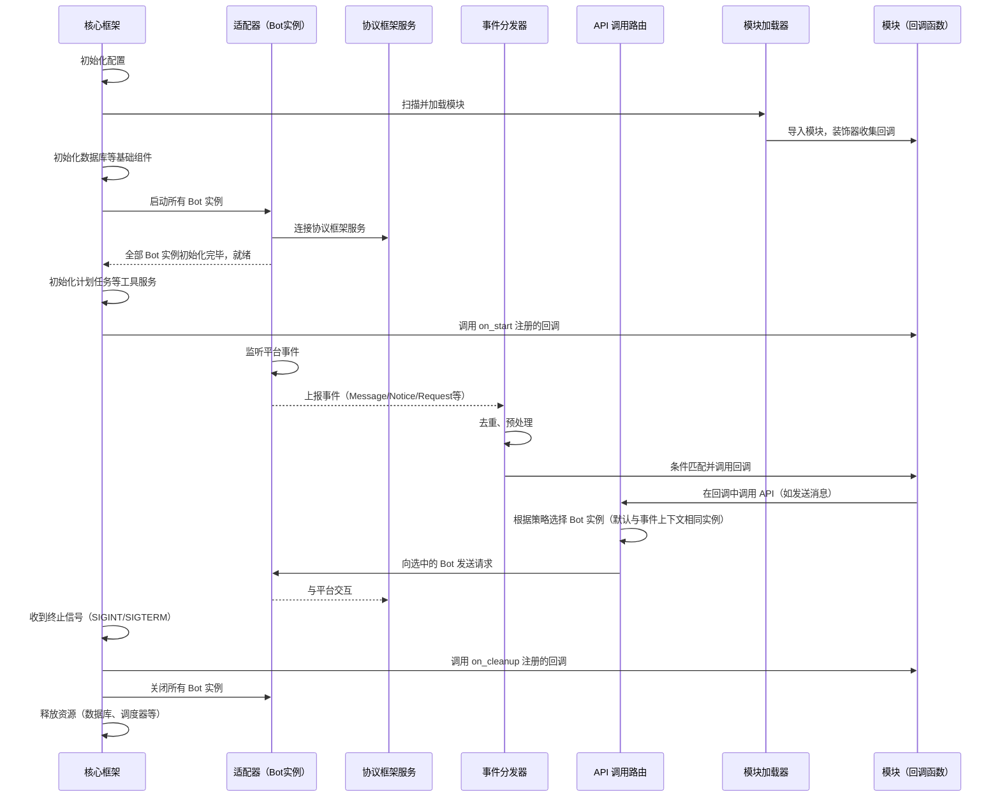

## 整体概览

1. **启动阶段**：框架初始化、加载配置、启动服务、加载模块并调用模块的 `on_start` 回调。
2. **运行阶段**：事件循环等待并分发[事件](./订阅与发布事件.md)，模块回调被触发，可调用 API 与平台交互。
3. **关闭阶段**：收到终止信号后，调用所有模块的 `on_cleanup` 回调，然后释放资源。

## 模块生命周期

一个 Aha 模块的生命周期包含以下阶段：

- **加载**：模块被导入：注册配置、装饰器注册回调等。
- **就绪**：框架完成全部启动流程，调用通过 `core.dispatcher.on_start` 注册的回调函数。
- **运行**：事件触发模块的回调，模块通过 API 与平台交互。
- **卸载**：框架收到终止运行请求时，调用通过 `core.dispatcher.on_cleanup` 注册的回调函数。
