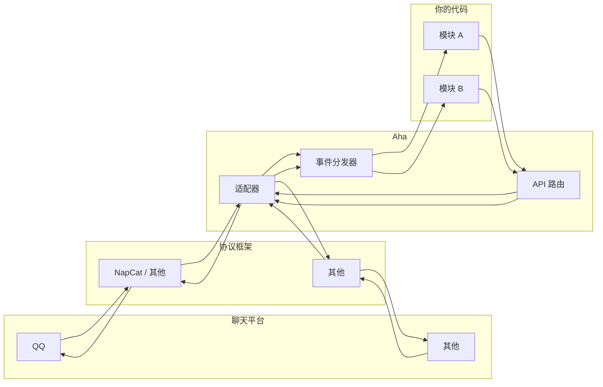
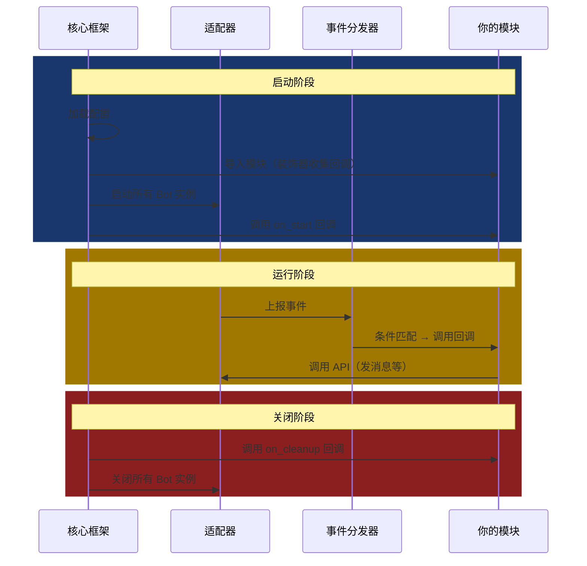

## 架构概览

### Aha 的基本流程

1. 通过**适配器**连接各协议框架（如 NapCat）—— 适配器负责与协议框架通信，将平台事件转换为 Aha 内部统一的[事件对象](../数据结构/事件对象.md)。
2. 将事件分发给**模块**中注册的回调函数 —— 这是你写业务逻辑的地方。
3. 将模块的 API 调用转发回协议平台 —— 发消息、踢人、禁言等操作。



### 设计哲学

| 原则 | 说明 |
| --- | --- |
| **事件驱动** | 一切从事件出发。用户发消息是事件、加群是事件、甚至模块之间的通信也是事件。你只需声明"当 X 发生时，执行 Y"。 |
| **声明式直接匹配消息** | 注册回调时描述“我要处理什么样的消息”，而非在回调里手写 if-else。Aha 在分发事件前就已筛选完成。 |
| **Python 模块即 Aha 模块** | 一个 Aha 模块就是一个 `modules/` 下的 Python 包。无需注册入口。 |
| **巨量轮子** | Aha 内置具有一致性、体系化的轮子，覆盖各种需求。 |

### Aha 生命周期与你的模块



> 更详细的时序图见 [Aha 生命周期](../Aha%20生命周期.md)。

---

## 构建一个完整模块

### 准则与注意事项

1. Aha 与协议框架（如 NapCat）互为独立的程序，不具备绝对依赖性。Aha 具有自己的标准。
2. 业务逻辑中应尽可能采用异步方案。
3. 本框架提供的特性并不都保证线程安全，详见各个文档中可能存在的说明。若有需要可以使用 [aiologic](https://github.com/x42005e1f/aiologic) 库提供的同步源语。
4. 一个 Aha 进程可以同时对接多个协议服务，请注意相关逻辑的适配。

---

我们通过为一个**每日签到**模块逐步扩展功能进行基本教学。从最简版本开始，逐版引入 Aha 的特性，每个版本都**可直接运行**。

> 创建模块目录 `modules/daily_sign/`，每版代码写入 `modules/daily_sign/__init__.py`，然后重启 Aha 即可看到效果。
>
> 不想重启也可以在配置文件中将 `aha.debug` 设置为 `true`，然后用 super 账号向机器人发送“重载”即进行模块热重载。该特性由内置模块 `reload` 提供。

### 版本 0：最简可用

**目标**：用户发送 `签到`，机器人回复"签到成功"。

```python
import logging
from core.dispatcher import on_message
from models.api import Message

logger = logging.getLogger()

@on_message(Pmsg == "签到")
async def _(event: Message):
    logger.info(f"用户 {await event.user_aha_id()} 执行了签到")
    await event.reply("签到成功！")
```

### 版本 1：防止重复签到（引入长效）

**问题**：当前用户可以无限次签到，我们需要记录"今天是否已签到"。

Aha 提供了两种数据持久化方案：轻量的 [SimpleStore](./内置轮子与最佳实践/长效数据.md#simplestore不推荐) 和[基于 SQLAlchemy](./内置轮子与最佳实践/长效数据.md#通过-sqlalchemy-操作数据库) 的长效数据。先看前者：

```python
from datetime import date
from services.data_store import SimpleStore

data_store = SimpleStore()

@on_message(Pmsg == "签到")
async def _(event: Message):
    aha_id = await event.user_aha_id()
    today = date.today()

    last = data_store.get(aha_id)
    if last and last == today:
        return await event.reply("你今天已经签到过了！")

    data_store[aha_id] = today
    await event.reply("签到成功！")
```

像字典一样直观，但不推荐生产环境使用。下为**SQLAlchemy 方案**，后续所有版本也沿用此方案。

在 `modules/daily_sign/` 下新建 `database.py`：

```python
# modules/daily_sign/database.py
from datetime import date
from sqlalchemy import BigInteger, Date
from sqlalchemy.orm import Mapped, mapped_column
from core.database import dbBase

class SignRecord(dbBase):
    __tablename__ = "sign_record"

    user: Mapped[int] = mapped_column(BigInteger, primary_key=True)
    last_date: Mapped[date] = mapped_column(Date)
```

**为什么表要继承 `dbBase`？**  
继承后会提供如下三个逻辑：
- 使用 Aha 维护的数据库。
- 将表名重定向为 `sign_record__daily_sign`（加上模块名前缀），避免不同模块的表名冲突。
- Aha 实现了基于 Alembic 的[自动迁移](../数据结构/README.md)能力，在大多数情况下框架会自动处理建表和升级。

更新 `__init__.py`：

```python
from core.database import db_sessionmaker
from utils.sqlalchemy import upsert
from .database import SignRecord

@on_message(Pmsg == "签到")  # 这是不区分小写的正则，若需绝对匹配则用 @on_message(Pmsg == "签到")
async def _(event: Message):
    aha_id = await event.user_aha_id()
    today = date.today()

    async with db_sessionmaker() as session:
        record: SignRecord | None = await session.get(SignRecord, aha_id)
        if record and record.last_date == today:
            return await event.reply("你今天已经签到过了！")

        await session.execute(upsert(SignRecord, user=aha_id, last_date=today))
        await session.commit()

    await event.reply("签到成功！")
```

**为什么用 `event.user_aha_id()` 而不是 `event.user_id`？**  
- `event.user_id` 是平台原生 ID（如 QQ 号），而 `event.user_aha_id()` 返回的是 [Aha ID](./跨平台统一%20ID.md) —— 一个跨平台统一的整数标识。如果未来你的机器人同时接入多个平台（如 QQ 和 Telegram），用 Aha ID 可以让同一个逻辑自然兼容多平台，无需额外适配。

### 版本 2：签到获得积分（引入经济系统）

**需求**：签到应该给用户奖励积分，激励每日活跃。

Aha 提供了[经济系统](./内置轮子与最佳实践/经济系统.md)的基础支持，支持 Decimal 精度。

```python
from services.point import adjust_point

@on_message(Pmsg == "签到")
async def _(event: Message):
    aha_id = await event.user_aha_id()
    today = date.today()

    async with db_sessionmaker() as session:
        record = await session.get(SignRecord, aha_id)
        if record and record.last_date == today:
            return await event.reply("你今天已经签到过了！")

        await session.execute(upsert(SignRecord, user=aha_id, last_date=today))
        # 签到奖励 10 积分
        point = await adjust_point(aha_id, 10, session=session)
        await session.commit()

    await event.reply(f"签到成功！当前积分：{point}")
```

`adjust_point` 的第三个参数传入了 `session=session`，因为签到记录的写入和积分的调整应该在同一个数据库事务中完成 —— 要么都成功，要么都回滚。当然可以不提供该参数，Aha 会自动创建一个新 session。

### 版本 3：可配置的奖励金额（引入统一配置系统）

**问题**：奖励金额硬编码为 10，无法便捷调整。

Aha 的[统一配置系统](./统一配置系统.md)让每个模块的参数出现在同一个 YAML 文件中，修改配置即可调整行为。

```python
from core.config import cfg

# 注册配置项：默认奖励 10 积分，可在 config.*.yml 中修改
REWARD = cfg.register("reward", 10, "签到奖励积分数")

@on_message(Pmsg == "签到")
async def _(event: Message):
    aha_id = await event.user_aha_id()
    today = date.today()

    async with db_sessionmaker() as session:
        record = await session.get(SignRecord, aha_id)
        if record and record.last_date == today:
            await event.reply("你今天已经签到过了！")
            return

        await session.execute(upsert(SignRecord, user=aha_id, last_date=today))
        point = await adjust_point(aha_id, REWARD, session=session)
        await session.commit()

    await event.reply(f"签到成功！+{REWARD} 积分，当前积分：{point}")
```

启动 Aha 后，`config.dev.yml` 中会自动出现：

```yaml
modules.daily_sign:
  # 签到奖励积分数
  reward: 10
```

**`REWARD` 的值是？**  
`cfg.register` 返回配置文件中该项的值。详见[统一配置系统](./统一配置系统.md)。

### 版本 4：使用消息前缀

**问题**：如果用户在聊天中自然提到"签到"这个词，机器人也会触发签到逻辑，造成误触。

Aha 的[消息前缀](./内置轮子与最佳实践/消息前缀.md)机制通过事件匹配表达式中的 `Pprefix` 字段解决这个问题。

```python
from core.expr import Pprefix

@on_message(
    "签到",
    Pprefix == True,  # 要求消息必须带有前缀
)
async def _(event: Message):
    # ...签到逻辑...
```

在 `config.dev.yml` 中设置全局前缀：

```yaml
aha:
  global_msg_prefix: "/"  # 或 "~"、"#" 等
```

现在，用户必须发送 `/签到` 才会触发签到，而`签到`将无法触发。

**该方案的优势在？**  
1. **前缀在传递回调前乃至消息匹配前就已被剥离**：`event.message` 与 `event.message_str` 中都不包含前缀，后续逻辑更干净。
2. **默认支持 @机器人 作为前缀**：用户 `@bot 签到` 也能触发，无需额外处理。
3. **可便捷调整**：采用配置文件中的配置项，还可以通过模块的独立配置项 `msg_prefix` 设置为不同的前缀。
4. **声明式**：匹配条件在一开始就明确了"需要前缀"，阅读代码时一目了然。

### 版本 5：查看积分排行（引入 DSL）

**需求**：用户发送 `签到排行 20` 查看积分 Top 20，不传参数默认 Top 10。

我们用[事件匹配表达式](./事件匹配表达式.md)的 `Pcommand` 来解析命令形式的消息，`Pcommand.startswith` 声明命令前缀。

> 更多使用方式见 [PM.command](./事件匹配表达式.md#个别字段的特殊逻辑)。

```python
from collections.abc import Sequence
from core.expr import Pcommand  # Pcommand 是 PM.command 的别名
from sqlalchemy import select, desc

@on_message(Pcommand.startswith(["签到排行"]))
async def _(event: Message, args: Sequence):
    top_n = int(args[0]) if args else 10  # 用户传了参数则用，否则默认 10

    from models.core import Point
    async with db_sessionmaker() as session:
        stmt = select(Point.aha_id, Point.point).order_by(desc(Point.point)).limit(top_n)
        result = await session.execute(stmt)
        rows = result.all()

    if not rows:
        await event.reply("暂无签到数据。")
        return

    lines = [f"🏆 签到积分排行 Top {top_n}："]
    for i, (aha_id, point) in enumerate(rows, 1):
        lines.append(f"{i}. {aha_id} — {point} 积分")

    await event.reply("\n".join(lines))
```

**`Pcommand.startswith(["签到排行"])` 如何工作？**

1. Aha 将消息按空格分割为命令参数列表。
2. `startswith` 检查前缀：第一个参数必须为 `签到排行`。
3. 匹配后，第二个参数起的所有参数组成列表通过 `args` 关键字参数传入回调。

> **对比：用正则实现同样效果**：
> ```python
> import re
>
> @on_message(r"签到排行\s*(\d*)")
> async def _(event: Message, match_: re.Match):
>     top_n = int(match_[1]) if match_[1] else 10
>     # ...
> ```
> 正则方案需要手动编写和调试正则表达式，参数多了以后可读性急剧下降；而 `Pcommand` 以声明式列表描述命令结构，意图一目了然。
> 此外，回调通过 `match_` 关键字参数接收 `re.Match` 对象。

### 版本 6：注册到菜单（引入菜单系统）

**需求**：用户希望有一个统一的入口来发现签到系统的所有功能。

Aha 的[菜单注册](./内置轮子与最佳实践/菜单注册.md)机制允许模块将入口词条注册到统一的菜单列表中。这里我们注册一个 `签到系统` 入口，由它来展示签到系统的全部子功能。

```python
@on_message(
    "签到系统",
    register_help={"签到系统": "每日签到、积分排行等签到相关功能"}
)
async def _(event: Message):
    await event.reply(
        "功能：\n"
        "• 签到 — 每日签到获取积分\n"
        "• 签到排行 — 查看积分排行榜"
    )
```

Aha 本身不具有菜单展示功能，需自行实现，详见[菜单注册](./内置轮子与最佳实践/菜单注册.md)。

### 版本 7：发送图片与复杂消息（引入消息链）

**需求**：签到成功时的回复增加一张图片，让交互更生动。

Aha 的消息内容不是简单的字符串，而是由多个**消息段**组成的[消息链](../数据结构/消息序列与消息段.md)。目前我们用 `event.reply("签到成功！")` 其实是一个简写，等价于回复一个 `Text` 消息段。现在我们来手动构造包含图片的复杂消息。

```python
from models.msg import Text, Image, MsgSeq

@on_message(Pmsg == "签到")
async def _(event: Message):
    # ...数据库与积分逻辑同上...

    msg = MsgSeq(
        f"签到成功！+{REWARD} 积分，当前积分：{point}",  # 普通字符串自动转为 Text 消息段
        Image(file="https://http.cat/images/200.jpg"),  # 可以为本地路径
    )
    await event.reply(msg)
```

**`MsgSeq`** 是 `list` 的子类，支持绝大多数 list 操作。每个元素是一个消息段。

> 也可以用 [Aha 码](./Aha%20码.md) 在字符串中嵌入消息段，例如 `"签到成功！[Aha:image,file=https://http.cat/images/200.jpg]"`。

### 版本 8：计划任务

**需求**：某些活动需要在每天零点自动执行，比如重置"连续签到天数"。（通过计划任务实现该逻辑十分逆天，此处仅供参考）

更多操作见[计划任务](./内置轮子与最佳实践/计划任务.md)。

```python
from core.dispatcher import on_start
from services.apscheduler import CronTrigger, sched

@on_start
async def _():
    # 每天零点执行重置逻辑
    await sched.add_schedule(reset_streaks, CronTrigger(hour=0, minute=0))

async def reset_streaks():
    """检查连续签到，中断超过一天的用户的连续签到计数"""
    # ...逻辑...
```

`@on_start` 注册的回调在框架启动完毕后执行，用于初始化逻辑。计划任务还可以使用持久调度器 `add_persist_schedule`，重启后调度不丢失。

### 版本 9：本地化支持

**需求**：机器人可能要同时服务多种语言的用户，我们希望根据用户语言自动切换回复。

Aha 的[本地化](./本地化.md)系统允许你为每种语言准备翻译文件，框架根据消息的语言自动选择。

创建 `modules/daily_sign/locales/` 目录：

```yaml
# modules/daily_sign/locales/zh_CN.yml
sign_command: "签到"
sign_system: "签到系统"
rank_command: "签到排行"
sign_success: "签到成功！+{reward} 积分，当前积分：{point}"
already_signed: "你今天已经签到过了！"
rank_title: "🏆 签到积分排行 Top {top_n}："
rank_empty: "暂无签到数据。"
rank_line: "{index}. {user} — {point} 积分"
menu_text: "签到系统功能：\n• {sign_cmd} — 每日签到获取积分\n• {rank_cmd} — 查看积分排行榜"
```

```yaml
# modules/daily_sign/locales/en.yml
sign_command: "checkin"
sign_system: "sign system"
rank_command: "sign rank"
sign_success: "Check-in successful! +{reward} points, current: {point}"
already_signed: "You've already checked in today!"
rank_title: "🏆 Check-in Leaderboard Top {top_n}:"
rank_empty: "No check-in data yet."
rank_line: "{index}. {user} — {point} points"
menu_text: "Sign-in System:\n• {sign_cmd} — Daily check-in for points\n• {rank_cmd} — View leaderboard"
```

更新模块代码以使用本地化：

```python
from core.i18n import gettext  # gettext() 返回 LocalizedString

# 签到回调：用 gettext("sign_command") 匹配所有语言中的签到命令
@on_message(Pmsg == gettext("sign_command"))
async def _(event: Message, localizer):
    aha_id = await event.user_aha_id()
    today = date.today()

    async with db_sessionmaker() as session:
        record = await session.get(SignRecord, aha_id)
        if record and record.last_date == today:
            return await event.reply(localizer("already_signed"))

        await session.execute(upsert(SignRecord, user=aha_id, last_date=today))
        point = await adjust_point(aha_id, REWARD, session=session)
        await session.commit()

    msg = MsgSeq(
        Text(text=localizer("sign_success").format(reward=REWARD, point=point)),
        Image(file="https://http.cat/images/200.jpg"),
    )
    await event.reply(msg)


# 排行回调：用 gettext("rank_command") 匹配
@on_message(Pcommand.startswith([gettext("rank_command")]))
async def _(event: Message, localizer, args: Sequence):
  ...
```

**发生了什么魔法？**

1. `gettext("sign_command")` 返回一个 `LocalizedString` 实例（继承自 `str`），它关联了所有语言的翻译。
2. 当 `on_message` 用 `LocalizedString` 做匹配时，Aha 会**遍历该键在所有语言中的值**去匹配用户消息 —— 中文用户发"签到"、英文用户发"checkin"，都能命中。
3. 匹配成功后，Aha 创建对应语言的翻译器 `localizer`。`localizer("key")` 返回对应语言的文案，`.format()` 仍返回 `LocalizedString`，可继续用于匹配。

Aha 的本地化系统设计了[语言回退链](./本地化.md#语言回退链)，保证了即使缺少某种方言的翻译也能优雅降级。

### 完整代码总览

将上述所有概念整合后的模块结构：

```
modules/daily_sign/
├── __init__.py      # 主逻辑
├── database.py      # SQLAlchemy 数据模型
└── locales/
    ├── zh_CN.yml    # 中文翻译
    └── en.yml       # 英文翻译
```

<details>
<summary>点击展开完整代码</summary>

```python
# modules/daily_sign/__init__.py
import logging
from collections.abc import Sequence
from datetime import date
from core.config import cfg
from core.database import db_sessionmaker
from core.dispatcher import on_message, on_start
from core.expr import Pcommand, Pmsg, Pprefix
from core.i18n import gettext
from models.api import Message
from models.msg import Text, Image, MsgSeq
from services.apscheduler import sched
from services.point import adjust_point
from sqlalchemy import select, desc
from utils.apscheduler import CronTrigger
from utils.sqlalchemy import upsert
from .database import SignRecord

logger = logging.getLogger(__name__)
REWARD = cfg.register("reward", 10, "签到奖励积分数")

@on_message(Pmsg == gettext("sign_command"))
async def sign_in(event: Message, localizer):
    aha_id = await event.user_aha_id()
    today = date.today()
    logger.info(f"用户 {aha_id} 执行了签到")

    async with db_sessionmaker() as session:
        record = await session.get(SignRecord, aha_id)
        if record and record.last_date == today:
            return await event.reply(localizer("already_signed"))

        await session.execute(upsert(SignRecord, user=aha_id, last_date=today))
        point = await adjust_point(aha_id, REWARD, session=session)
        await session.commit()

    msg = MsgSeq(
        Text(text=localizer("sign_success").format(reward=REWARD, point=point)),
        Image(file="https://http.cat/images/200.jpg"),
    )
    await event.reply(msg)


@on_message(Pcommand.startswith([gettext("rank_command"), int]))
async def sign_rank(event: Message, localizer, args: Sequence):
    top_n = args[0] if args else 10
    from models.core import Point

    async with db_sessionmaker() as session:
        stmt = select(Point.aha_id, Point.point).order_by(desc(Point.point)).limit(top_n)
        result = await session.execute(stmt)
        rows = result.all()

    if not rows:
        return await event.reply(localizer("rank_empty"))

    lines = [localizer("rank_title").format(top_n=top_n)]
    for i, (aha_id, point) in enumerate(rows, 1):
        lines.append(localizer("rank_line").format(index=i, user=aha_id, point=point))
    await event.reply("\n".join(lines))


@on_message(
    gettext("sign_system"),
    register_help={gettext("sign_system"): "每日签到、积分排行等功能"}
)
async def sign_menu(event: Message, localizer):
    await event.reply(localizer("menu_text").format(
        sign_cmd=localizer("sign_command"),
        rank_cmd=localizer("rank_command"),
    ))


@on_start
async def setup_reset():
    await sched.add_schedule(reset_streaks, CronTrigger(hour=0, minute=0))

async def reset_streaks():
    pass  # 重置连续签到逻辑
```

</details>

## 部分特性示例

上述签到模块仅涉及 `Message` 事件。Aha 还支持其他事件类型和其他特性。

**更多特性详见[导航](./README.md)**。

### 处理 Request 事件（加群申请等）

当有人申请加群或加好友时，产生 [Request](../数据结构/事件对象.md#request) 事件。

```python
from core.dispatcher import on_request
from models.api import Request

@on_request("group", "invite")  # 主类型：群，子类型：邀请
async def _(event: Request):
    await event.approve()        # 同意请求
    # await event.approve(False) # 拒绝请求
```

`on_request` 的第一个位置参数是主类型，第二个是子类型。

### 处理 Notice 事件（群成员变更等）

收到群成员增加、减少、管理员变更等通知时，产生[Notice](../数据结构/事件对象.md#notice) 事件。

```python
from core.dispatcher import on_notice
from models.api import Notice

@on_notice("group_increase", "approve")
async def _(event: Notice):
    # 有新成员加入群聊
    await event.reply(f"欢迎新成员！")
```

### 一次性回调

有时你需要"等待用户的下一条消息"这样的交互模式。通过注册回调时指定 `exp` 参数实现一次性回调。

```python
@on_message("一次性回调")
async def _(event: Message):
    # 注册一个 5 分钟后过期的一次性回调
    on_message("114", exp=5*60, callback=callback)
    await event.reply("已注册，接下来发送 114 试试")

async def callback(event: Message):
    await event.reply("514")
```

详见[订阅与发布事件](./订阅与发布事件.md)的一次性回调节。

### 调用 API

除了 `event.reply` / `event.send` 等便捷方法，你还可以通过 `core.api.API` 调用更多 API。

```python
from core.api import API

@on_message("bot信息")
async def _(event: Message):
    info = await API.get_login_info()
    await event.reply(f"当前登录账号：{info}")
```

`API` 类声明了大量静态方法，调用时会自动转发到触发当前事件的适配器实例。若不在事件上下文中调用则需要手动指定 `bot` 参数，详见[向协议服务请求](./向协议服务请求/README.md#指定-bot-实例)。
